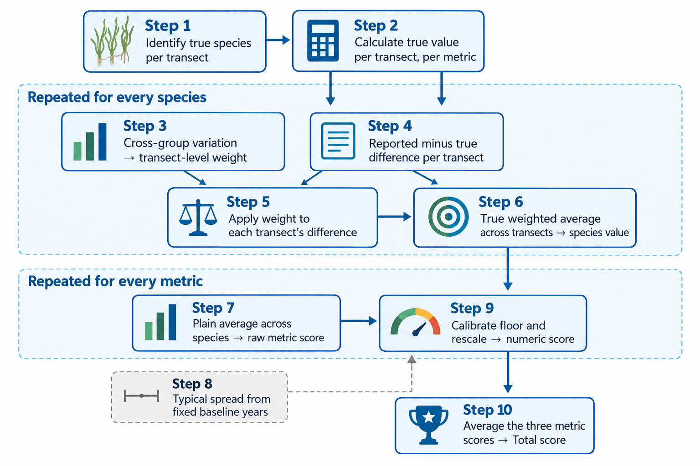

```{r}
library(tbeptools)
library(dplyr)
library(tidyr)
library(purrr)
library(ggplot2)
library(gt)
library(here)

source(here('R/funcs.R'))
load(here('data/trndat.rda'))

# example year used throughout
ex_yr  <- 2025

# difference basis per metric: Abundance and Blade Length on their raw scale,
# Short Shoot Density as percent (see "Why the difference basis differs by
# metric" below for why Blade Length and Short Shoot Density differ)
scr_metric <- c(Abundance = 'abs', `Blade Length` = 'abs', `Short Shoot Density` = 'pct')

# pre-compute objects reused across sections
truespp  <- truespp_fun(trndat, ex_yr)
truvar   <- truvar_fun(trndat, ex_yr)
cal      <- calibrate_scr_fun(trndat, metric = scr_metric)
allgrpscr <- allgrpscr_fun(trndat, ex_yr, truvar, cal = cal, metric = scr_metric)

# non sav species
non <- '^AA|^DA|^DB|^DG|^DR|^CYAN'

# example group
ex_grp <- trndat |> 
  dplyr::filter(yr == ex_yr) |>
  dplyr::filter(grp == 'C') |> 
  dplyr::pull(grpact) |> 
  unique()

ex_grp_label <- trndat |> 
  dplyr::filter(grpact == ex_grp) |>
  dplyr::pull(grp) |>
  unique()

evalgrp <- evalgrp_fun(trndat, ex_yr, ex_grp, truvar)
```

## Overview

Seagrass transects are monitored in Tampa Bay each year by multiple resource management agencies.  To support these efforts, the Tampa Bay Estuary Program coordinates an annual intercalibration training prior to the field season.  This intercalibration effort ensures that all participating groups are using consistent methods and interpretations. Seagrasses are independently assessed by each group at the same locations and the results are compared using report cards.  The intent of these report cards is to highlight areas where each group is doing well and where efforts could be improved to ensure consistency. This document describes how the report cards are prepared and what the scores mean.

Because there is no single external ground truth, scores are based on how consistently groups agree with each other. A group that reports values close to the cross-group average for the year earns a high score and one that deviates substantially earns a lower score.

Scores are calculated for three field measurements for each seagrass species:

- **Abundance**: Braun-Blanquet (BB) cover category (0 = No cover, 0.1 = Solitary, 0.5 = Few, 1 = <5%, 2 = 5-25%, 3 = 25-50%, 4 = 51-75%, 5 = 76-100%)
- **Blade Length**: average blade length in cm
- **Short Shoot Density**: shoots per m²

Whether each group correctly identified which species were present is also factored into the abundance score. These three metric scores are averaged into an overall total score, which is then converted to a letter grade.

Note that "transect" is used herein to describe the intercalibration sites during training, which are quadrats at fixed locations.  For the actual transect sampling, sites are set meter marks along a transect line.

### The scoring workflow, step by step

The full scoring workflow, from raw field data to a final letter grade, is:

1. Identify the "true" (consensus) species at each transect.
2. Calculate the "true" value for each metric at each transect, as the cross-group average.
3. Calculate the cross-group variation in reported values for each species/transect/metric, for the transect-level weight.
4. Calculate each group's difference (reported minus true) for each species/transect/metric.
5. Apply the transect-level weight from step 3 to each transect's difference from step 4, discounting differences at transects where groups disagreed a lot.
6. Combine the weighted per-transect differences from step 5 across transects into one difference value per species/metric, using a true weighted average (weighted by the same transect-level weight from step 3, not a plain average), so a transect with a larger weight counts for more.
7. Roll up species into a raw metric score as the plain average of those per-species differences.
8. Establish the typical spread of raw metric scores between groups within a year, using a fixed baseline period of `r length(cal$cal_yrs)` years (`r min(cal$cal_yrs)`-`r max(cal$cal_yrs)`), this is the baseline every year (including years in the baseline itself) is compared against to judge whether that year was unusually tight or loose. The baseline is fixed rather than recomputed as new years are added, so a report card's calibration doesn't shift after the fact.
9. Calibrate the score floor for that year and metric based on how tight or loose the cohort was that year relative to the typical spread from step 8, then rescale the raw score to a 0-100 numeric score.
10. Get the overall Total score as the plain average of the three metrics' numeric scores, then convert every numeric score, per-metric and Total, to a letter grade using fixed thresholds.

The list above reads top to bottom, but the steps aren't a single chain: step 3's weight is reused twice (in step 5 and again in step 6), and step 8 is a separate calibration pipeline built once from the fixed baseline years, not something computed along the way for a given group, it only joins back in at step 9. The diagram below shows those connections.

{#fig-scoring-process}

The sections below work through each of these ten steps in detail. Section headings are grouped to match how the steps are connected, so a heading spanning several step numbers (e.g. "Steps 3-7") covers all of them together rather than one at a time, ending with a full worked example applying all ten steps to one group.

## Step 1: The Consensus Species List

Not every species recorded across all groups counts toward scoring. A species at a given transect (site/quadrat) is considered present if at least two distinct groups reported it with non-zero abundance. This removes likely misidentifications while still being inclusive, i.e., a species does not need to be unanimous, just corroborated.  Species identifications include seagrass and macroalgae. Both are scored on Abundance, since correctly identifying a species as present or absent matters regardless of species type (see *Species Identification Penalties* below), but only seagrass is used to assess Blade Length and Short Shoot Density, which are not measured for macroalgae.

```{r}
#| label: tbl-truespp
#| tbl-cap: !expr paste("Consensus species at each transect in", ex_yr, "as species reported by at least two groups.")

truespp |>
  dplyr::count(Site, name = 'n_species') |>
  dplyr::mutate(
    Species = purrr::map_chr(Site, function(s){
      truespp |>
        dplyr::filter(Site == s) |>
        dplyr::pull(Species) |>
        sort() |>
        paste(collapse = ', ')
    }), 
    Site = as.numeric(Site)
  ) |>
  dplyr::rename(Transect = Site, `Species count (richness)` = n_species) |>
  dplyr::arrange(Transect) |> 
  gt::gt() |>
  gt::tab_style(
    style = gt::cell_text(style = 'italic'),
    locations = gt::cells_body(columns = Species)
  ) |>
  gt::cols_align('left') |>
  gt::tab_style(
    style = list(gt::cell_fill(color = '#2166ac'), gt::cell_text(color = 'white', weight = 'bold')),
    locations = gt::cells_column_labels()
  ) |>
  gt::tab_options(
    table.border.top.color = '#2166ac',
    table.border.bottom.color = '#2166ac',
    column_labels.border.bottom.color = '#2166ac'
  )
```

The consensus list is created per transect, so a species may be on the list at one transect but not another.

## Step 2: True Values

For each consensus species at each transect, true values are calculated as the cross-group average:

- **Abundance**: group Braun-Blanquet values (0, 0.1, 0.5, 1, 2, 3, 4, 5) are averaged directly across groups, then snapped to the nearest valid BB value (no coverage, solitary, few, <5%, 5-25%, 26-50%, 51-75%, 76-100%).
- **Blade Length** and **Short Shoot Density**: simple means across groups.

Only consensus species enter this calculation. This prevents a misidentified species (recorded by only one group) from distorting the true values for everyone else.

```{r}
#| label: tbl-truvar
#| tbl-cap: !expr paste('Example "true" values at one transect in', ex_yr, 'determined by cross-group averages for consensus species.')

truvar |>
  dplyr::filter(Site == '8') |> #min(as.numeric(Site))) |>
  tidyr::pivot_wider(names_from = var, values_from = truval) |>
  dplyr::mutate(
    `Abundance (0, 0.5, 1, 2, 3, 4, 5)` = as.character(Abundance),
    `Blade Length (cm)` = ifelse(grepl(non, Species), 'NA', round(`Blade Length`, 1)),
    `Short Shoot Density (per m²)` = ifelse(grepl(non, Species), 'NA', round(`Short Shoot Density`, 1))
  ) |>
  dplyr::select(Transect = Site, Species, `Abundance (0, 0.5, 1, 2, 3, 4, 5)`, `Blade Length (cm)`, `Short Shoot Density (per m²)`) |>
  gt::gt() |>
  gt::tab_style(
    style = gt::cell_text(style = 'italic'),
    locations = gt::cells_body(columns = Species)
  ) |>
  gt::cols_align('left') |>
  gt::tab_style(
    style = list(gt::cell_fill(color = '#2166ac'), gt::cell_text(color = 'white', weight = 'bold')),
    locations = gt::cells_column_labels()
  ) |>
  gt::tab_options(
    table.border.top.color = '#2166ac',
    table.border.bottom.color = '#2166ac',
    column_labels.border.bottom.color = '#2166ac'
  )
```

## Steps 3-7: Group Differences and Metric Scores

For each metric (Abundance, Blade Length, Short Shoot Density), a group's reported values are compared to the true values species by species and transect by transect, then rolled up step by step into a single score per group per metric. Before any of that rollup, though, a report can go wrong in a different way: reporting a species that isn't really there, or missing one that is. Those species identification errors are handled first, since they change what counts as a "difference" in the first place.

### Species Identification Penalties

Comparing a group's reported values to the true values across all consensus species and transects reveals two types of species identification errors:

**Missed species**: a species is present but the group did not record it. The group's abundance for that species is treated as "no coverage" (BB value 0) when computing the difference. The penalty scales with the true abundance of the missed species: missing a rare species is a small error, while missing a dominant one is a large error.

**False positives**: the group recorded a species that is not on the consensus list (i.e., no other group confirmed it). The true abundance is treated as "no coverage" (BB value 0), but unlike a missed species, the penalty is a fixed one category difference, not scaled by how high the group's reported abundance was. What category a group happens to report for a species nobody else saw is not evidence about whether the species was really there, so it should not make the penalty any larger or smaller. A false positive is still an error and still counts against the score, it just counts the same regardless of whether it was reported at "solitary" or "76-100%" cover.

These penalties only affect the abundance score. Blade Length and Short Shoot Density cannot be meaningfully penalised for species that were not found.

For Abundance, the difference is computed as a gap in ordinal category positions rather than in raw Braun-Blanquet numeric values. The eight BB categories are treated as equally spaced steps (1 = no coverage through 8 = 76–100%), so a difference of 1 means the group was one category apart from the true value, regardless of the numeric gap between those categories on the BB scale.  This implicitly assumes that there is similar difficulty in distinguishing between lower abundances (e.g., solitary vs few) and higher abundances (e.g., 51-75% vs 76-100%).

```{r}
#| label: tbl-evalgrp
#| tbl-cap: !expr paste0('Reported vs. true values for group "', ex_grp_label, '" at one transect in ', ex_yr, '.  Note the missed species in row 1 and the false positive in row 2.')

evalgrp |>
  dplyr::filter(Site == '8') |>
  dplyr::select(
    Transect = Site, Species,
    `Abundance reported` = `Abundance aveval`,
    `Abundance true`     = `Abundance truval`,
    `Blade Length reported` = `Blade Length aveval`,
    `Blade Length true`     = `Blade Length truval`, 
    `Short Shoot Density reported` = `Short Shoot Density aveval`,
    `Short Shoot Density true`     = `Short Shoot Density truval`
  ) |>
  dplyr::mutate(dplyr::across(`Abundance reported`:`Abundance true`, ~ ifelse(is.na(.), '—', as.character(.)))) |>
  dplyr::mutate(dplyr::across(`Blade Length reported`:`Short Shoot Density true`, ~ ifelse(grepl(non, Species), 'NA', as.character(.)))) |>
  dplyr::arrange(Species) |>
  gt::gt() |>
  gt::tab_style(
    style = gt::cell_text(style = 'italic'),
    locations = gt::cells_body(columns = Species)
  ) |>
  gt::cols_align('left') |>
  gt::tab_style(
    style = list(gt::cell_fill(color = '#2166ac'), gt::cell_text(color = 'white', weight = 'bold')),
    locations = gt::cells_column_labels()
  ) |>
  gt::tab_options(
    table.border.top.color = '#2166ac',
    table.border.bottom.color = '#2166ac',
    column_labels.border.bottom.color = '#2166ac'
  )
```

### Per-transect difference and weight

At each **transect**, a difference is discounted when the different groups had a lot of trouble agreeing with each other there. That disagreement reflects how hard the species was to pin down at that specific site. It is not the evaluated group's own performance. This is the only place a weight is applied. An earlier version of this methodology also tried to weight species by how consistent a group's own difference was for that species across transects, but with typically only 2-4 transects per species per group that estimate was mostly sample-size noise (see *Combining species into a metric score* below), so species are instead combined with a plain average.

At transect $t$, the difference for species $s$ is

$$
d_{s,t} = \text{reported} - \text{true}
$$

for Abundance (an ordinal category-position difference, see *Species Identification Penalties* above) and Blade Length (a raw difference in cm), or the symmetric percent difference

$$
d_{s,t} = \frac{\text{reported} - \text{true}}{(\text{reported}+\text{true})/2}
$$

for Short Shoot Density (see *Absolute vs. percent difference* below). The one exception is a false positive transect for Abundance (see *Species Identification Penalties* above), where $d_{s,t}$ is fixed at 1 rather than computed from the reported category, since what category was reported is not evidence about whether the species was really there. Its weight is

$$
w_{s,t} = \frac{1}{1+\sigma_{s,t}}
$$

where $\sigma_{s,t}$ is the standard deviation, across all groups, of their individually reported values at that transect for that species:

$$
\sigma_{s,t} = \text{SD}_g\!\left(x_{g,s,t}\right)
$$

with $x_{g,s,t}$ denoting group $g$'s reported value for species $s$ at transect $t$, and the standard deviation taken across all reporting groups $g$, not just the group being scored. It measures how much trouble groups had agreeing with each other right there. A transect where fewer than two groups reported a value has an undefined $\sigma_{s,t}$ and gets full weight ($w_{s,t}=1$). This is independent of how much the true value itself might vary from one transect to another. That spatial variability plays no role anywhere in scoring.

### Rolling up to a species value

The species-level difference is a true weighted average, across transects, of the per-transect differences:

$$
\bar{d}_s = \frac{\sum_{t=1}^{T} w_{s,t}\,d_{s,t}}{\sum_{t=1}^{T} w_{s,t}}
$$

A transect's influence on $\bar{d}_s$ scales with its weight $w_{s,t}$, so a transect discounted for poor cross-group agreement is proportionally down-weighted relative to the other transects, rather than simply contributing a smaller value while every transect still counts equally toward the denominator.

### When weighting matters

The weight $w_{s,t}$ makes a difference count for less when groups had a lot of trouble agreeing with each other at that transect. Whether that raises or lowers $\bar{d}_s$ compared to a plain (unweighted) average of the same transects depends on whether the group's *large* differences happened to fall on the *hard* transects (high cross-group disagreement) or the *easy* ones (low disagreement). The two scenarios below use one hypothetical species reported at two transects to illustrate both cases.

```{r}
#| include: false
make_transect_scenario_tbl <- function(label, sigma, abs_dev){
  weight <- round(1 / (1 + sigma), 2)
  wavg   <- round(sum(weight * abs_dev) / sum(weight), 2)
  uwavg  <- round(mean(abs_dev), 2)
  sp_rows <- tibble::tibble(
    label = label, sigma = sigma, abs_dev = abs_dev, weight = weight
  )
  sm_rows <- tibble::tibble(
    label = c('Weighted average', 'Unweighted average'),
    sigma = NA_real_, abs_dev = NA_real_,
    weight = c(wavg, uwavg)
  )
  dplyr::bind_rows(sp_rows, sm_rows) |>
    gt::gt() |>
    gt::cols_label(
      label  = '',
      sigma  = gt::html('σ<sub>s,t</sub>'),
      abs_dev = gt::html('|d<sub>s,t</sub>|'),
      weight = gt::html('w<sub>s,t</sub> / average')
    ) |>
    gt::sub_missing(missing_text = '') |>
    gt::tab_style(
      style = list(gt::cell_fill(color = '#f0f0f0'), gt::cell_text(weight = 'bold')),
      locations = gt::cells_body(rows = label %in% c('Weighted average', 'Unweighted average'))
    ) |>
    gt::tab_style(
      style = gt::cell_text(weight = 'bold', color = '#2166ac'),
      locations = gt::cells_body(columns = weight, rows = label == 'Weighted average')
    ) |>
    gt::tab_style(
      style = gt::cell_text(weight = 'bold', color = '#d73027'),
      locations = gt::cells_body(columns = weight, rows = label == 'Unweighted average')
    ) |>
    gt::cols_align('center', columns = -label) |>
    gt::tab_style(
      style = list(gt::cell_fill(color = '#2166ac'), gt::cell_text(color = 'white', weight = 'bold')),
      locations = gt::cells_column_labels()
    ) |>
    gt::tab_options(
      table.border.top.color = '#2166ac',
      table.border.bottom.color = '#2166ac',
      column_labels.border.bottom.color = '#2166ac'
    )
}
```

**Scenario 1: a large difference on a hard transect is discounted, lowering the score**

A group is close to the true value at an easy transect (all groups agreed closely there, $\sigma_{s,t}=0$) but far off at a hard transect (groups disagreed a lot, $\sigma_{s,t}=3$).

```{r}
#| label: tbl-scenario1
#| tbl-cap: "Scenario 1: a large difference falls on the hard transect. The weighted average (blue) is lower than the unweighted average (red), reflecting an appropriately reduced penalty for missing a naturally hard-to-pin-down transect."
make_transect_scenario_tbl(
  label   = c('Transect A (easy, σ = 0)', 'Transect B (hard, σ = 3)'),
  sigma   = c(0, 3),
  abs_dev = c(0.5, 4.0)
)
```

Without weighting, the two transects average to 2.25. With weighting, Transect B's large difference is discounted because groups naturally struggled to agree there, yielding a weighted average of 1.2, a substantially better score. The group missed a hard target, and the scoring system appropriately reduces the penalty for that miss.

**Scenario 2: a large difference on an easy transect is not discounted, raising the score**

Now the same group is far off at the easy transect but close at the hard one.

```{r}
#| label: tbl-scenario2
#| tbl-cap: "Scenario 2: a large difference falls on the easy transect. The weighted average (blue) is higher than the unweighted average (red), appropriately penalising a large miss on a transect where all groups should have agreed."
make_transect_scenario_tbl(
  label   = c('Transect A (easy, σ = 0)', 'Transect B (hard, σ = 3)'),
  sigma   = c(0, 3),
  abs_dev = c(3.0, 0.5)
)
```

Without weighting, the two transects average to 1.75. With weighting, the small difference at the hard transect counts for less, so it no longer offsets the large miss at the easy transect, yielding a weighted average of 2.5. This is the appropriate outcome, since missing badly on a transect where all groups should agree is a genuine measurement error and should not be diluted by being close on a transect that is naturally harder to pin down.

The weight $w_{s,t}$ does not systematically produce better or worse scores than a simple average. Whether it is higher or lower depends on the data. What it always does is give more say to transects where cross-group agreement was good, and less relative say to transects where even the group of observers as a whole struggled to agree, regardless of whether the scored group's own report happened to be close or far off there.

### Combining species into a metric score

The metric score is a plain average, across species, of each species' absolute difference:

$$
\text{metric score}_{\text{raw}} = \frac{1}{S}\sum_s |\bar{d}_s|
$$

where $S$ is the number of species with a defined $\bar{d}_s$ that year. No further weighting is applied here. An earlier version of this step weighted a species by how consistent the group's own difference was for it across transects, on the reasoning that a species a group measured erratically should count for more. In practice, with typically only 2-4 transects available per species per group, that consistency estimate could not be separated from ordinary sample-size noise, and in several real cases it was driven almost entirely by how much the *true* value happened to vary across the few transects sampled, not by anything about the group's own performance. Rather than weight species by an unreliable number, every species now counts equally.

### Absolute vs. percent difference

$d_{s,t}$ is not defined the same way for every metric:

- **Abundance** uses the raw difference in ordinal Braun-Blanquet category positions (as described in *Species Identification Penalties* above). These categories are already unitless and applied the same way to every species, so there is no reason to convert them to a percent basis.
- **Blade Length** uses the raw difference in cm.
- **Short Shoot Density** instead uses the symmetric percent difference, averaged across transects (after the per-transect weight, and again after species are combined). This metric is measured in physical units (shoots/m²) where the typical magnitude varies a great deal by species (e.g., Halodule is characteristically much denser than Thalassia) and by how dense the selected quadrats happened to be that year. A raw difference of a few shoots/m² means something very different for a sparse bed than a dense one, and years with higher or lower density across the selected quadrats would otherwise look artificially more or less consistent across groups even when relative agreement hadn't changed. The percent difference puts every species and every year on the same relative scale, so a training year is not judged as unusually "tight" or "loose" just because the selected locations were denser or sparser that year.

Blade Length is also measured in a physical unit (cm) that varies by species, but it is deliberately *not* scored on percent difference. That split is its own topic, covered in *Why the difference basis differs by metric* below.

The weight $\sigma_{s,t}$ follows the same basis as $d_{s,t}$ for each metric:

- **Abundance** and **Blade Length** use $\sigma_{s,t}$ directly, in raw units (category positions, cm).
- **Short Shoot Density** instead uses $\sigma_{s,t}$'s **coefficient of variation**, dividing it by the true value at that transect, for the same reason $d_{s,t}$ does.

When $\sigma_{s,t}$ cannot be computed (fewer than two groups reporting at that transect), the weight defaults to its neutral value, full weight ($w_{s,t}=1$), for every metric.

### Why the difference basis differs by metric

Percent (or CV) normalization is only the right choice when the *typical size of a measurement disagreement* itself scales with the magnitude of the true value, a proportional, multiplicative error. If disagreement is instead roughly constant regardless of magnitude, an additive error, dividing by the true value doesn't remove a scale effect, it creates one: the same absolute disagreement looks smaller wherever the true value happens to be larger, for reasons that have nothing to do with how consistent groups actually were.

The figure below tests this directly using every species/year combination across the full training record. Each point is one species in one year: its true value (x-axis) against the mean absolute disagreement between groups that year (y-axis), both in the metric's native units.

```{r}
#| label: fig-magnitude-error
#| fig-cap: "Mean absolute disagreement between groups vs. true value magnitude, one point per species/year, across the full training record. Short Shoot Density shows a strong positive relationship: disagreement grows with density, consistent with a count-like process, so dividing by the true value correctly removes that scale effect. Blade Length shows essentially none: disagreement doesn't grow with blade length, so dividing by the true value would introduce a scale effect rather than remove one."
#| fig-height: 4.5
#| fig-width: 9.5

all_yrs <- sort(unique(trndat$yr))

mag_err_dat <- purrr::map(c('Blade Length', 'Short Shoot Density'), function(vr){
  purrr::map(all_yrs, function(y){
    tv   <- truvar_fun(trndat, y)
    grps <- trndat |> dplyr::filter(yr == y) |> dplyr::pull(grpact) |> unique()
    purrr::map(grps, function(g){
      eg <- evalgrp_fun(trndat, y, g, tv)
      sppdiff_fun(eg, vr) |> dplyr::mutate(grpact = g, yr = y, metric = vr)
    }) |> dplyr::bind_rows()
  }) |> dplyr::bind_rows()
}) |> dplyr::bind_rows()

mag_err_summ <- mag_err_dat |>
  dplyr::summarise(
    true_val = mean(truval, na.rm = TRUE),
    abs_diff = mean(abs(avediff), na.rm = TRUE),
    .by = c(metric, yr, Species)
  ) |>
  dplyr::filter(!is.na(true_val), !is.na(abs_diff))

mag_err_cor <- mag_err_summ |>
  dplyr::summarise(r = round(cor(true_val, abs_diff), 2), .by = metric)

ggplot(mag_err_summ, aes(x = true_val, y = abs_diff)) +
  geom_point(aes(colour = factor(yr)), size = 2.2, alpha = 0.8) +
  geom_smooth(method = 'lm', se = FALSE, colour = 'black', linewidth = 0.6) +
  geom_text(
    data = mag_err_cor, aes(label = paste0('r = ', r)),
    x = -Inf, y = Inf, hjust = -0.2, vjust = 1.5, inherit.aes = FALSE,
    size = 3.3, fontface = 'bold'
  ) +
  facet_wrap(~ metric, scales = 'free', nrow = 1) +
  scale_colour_viridis_d(name = 'Year') +
  labs(x = 'Species true value that year (cm or shoots/m²)',
       y = 'Mean absolute difference across\ngroups (cm or shoots/m²)') +
  theme_bw(base_size = 11) +
  theme(strip.background = element_rect(fill = '#004F7E'),
        strip.text = element_text(colour = 'white', face = 'bold'))
```

For Short Shoot Density, disagreement climbs steeply with density (r = `r mag_err_cor$r[mag_err_cor$metric == 'Short Shoot Density']`): a bed with more shoots present gives groups more opportunity to disagree on the count, the same pattern seen in count data generally. Percent difference correctly cancels that out, so a year or species with a naturally denser bed isn't penalized just for being dense.

The figure below confirms that the cancellation actually works: it repeats the same species/year points for Short Shoot Density, but with the y-axis switched to the percent (CV) difference actually used for scoring, instead of the raw shoots/m² difference shown above.

```{r}
#| label: fig-magnitude-error-cv
#| fig-cap: "Mean absolute percent (CV) difference between groups vs. true value magnitude for Short Shoot Density, one point per species/year, across the full training record. Unlike the raw shoots/m² difference in the previous figure, this shows only a weak relationship with density, confirming the percent basis removes most of the scale effect rather than just relocating it."
#| fig-height: 4
#| fig-width: 6

ssd_cv_summ <- mag_err_dat |>
  dplyr::filter(metric == 'Short Shoot Density') |>
  dplyr::summarise(
    true_val    = mean(truval, na.rm = TRUE),
    abs_pctdiff = mean(abs(aveperc), na.rm = TRUE),
    .by = c(yr, Species)
  ) |>
  dplyr::filter(!is.na(true_val), !is.na(abs_pctdiff))

ssd_cv_cor <- round(cor(ssd_cv_summ$true_val, ssd_cv_summ$abs_pctdiff), 2)

ggplot(ssd_cv_summ, aes(x = true_val, y = abs_pctdiff)) +
  geom_point(aes(colour = factor(yr)), size = 2.2, alpha = 0.8) +
  geom_smooth(method = 'lm', se = FALSE, colour = 'black', linewidth = 0.6) +
  annotate('text', x = -Inf, y = Inf, label = paste0('r = ', ssd_cv_cor),
           hjust = -0.2, vjust = 1.5, size = 3.3, fontface = 'bold') +
  scale_colour_viridis_d(name = 'Year') +
  scale_y_continuous(labels = scales::percent) +
  labs(x = 'Species true value that year (shoots/m²)',
       y = 'Mean absolute percent difference\nacross groups') +
  theme_bw(base_size = 11)
```

Short Shoot Density's percent difference shows a far weaker relationship with density (r = `r ssd_cv_cor`) than the strong one in raw units (r = `r mag_err_cor$r[mag_err_cor$metric == 'Short Shoot Density']`) above. The CV basis is doing most of what it's meant to: a dense bed and a sparse bed now contribute much more comparably to the score than they would in raw units. The residual negative trend is concentrated at the lowest true densities, a handful of species/year points below about 3 shoots/m², where a small true value in the denominator inflates the percent difference even for a modest raw miscount. That is a different, harder-to-eliminate artifact from the one motivating the move away from raw units in the first place, and worth keeping in mind when interpreting Short Shoot Density scores in years with especially sparse beds.

For Blade Length, disagreement is essentially flat regardless of blade length (r = `r mag_err_cor$r[mag_err_cor$metric == 'Blade Length']`): however consistent, or not, groups are at measuring a 10 cm blade, they are about equally consistent measuring a 30 cm one. This is closer to a fixed measurement precision (e.g., where along a tapering or curled blade someone chooses to measure) than a process that scales with the plant. Dividing by the true value here would not remove a magnitude effect, it would manufacture one. That is exactly what produced 2020's oddly tight-looking Blade Length scores under an earlier version of this methodology that scored Blade Length on percent difference: that year happened to have unusually long blades, which mechanically shrank the percent differences even though the raw cm disagreement was unremarkable.

Based on this, **Blade Length is scored on the raw cm difference** (`abs`) rather than percent difference, while **Short Shoot Density keeps the percent/CV basis** (`pct`). Abundance, already on a unitless ordinal scale, is unaffected either way.

```{r}
#| label: tbl-sppdiff
#| tbl-cap: !expr paste0("Per-species difference summary of the abundance metric across sites for group '", ex_grp_label, "' in ", ex_yr, ".")

sppdiff_fun(evalgrp, 'Abundance') |>
  dplyr::mutate(
    aveval  = factor(aveval  - 1, levels = 0:7,
                     labels = c('no coverage','solitary','few','<5%','5-25%','25-50%','51-75%','76-100%')),
    truval  = factor(truval  - 1, levels = 0:7,
                     labels = c('no coverage','solitary','few','<5%','5-25%','25-50%','51-75%','76-100%')),
    avediff = round(avediff, 2)
  ) |>
  dplyr::select(Species, `Reported (avg)` = aveval, `True (avg)` = truval,
                `Mean difference` = avediff) |>
  gt::gt() |>
  gt::sub_missing(missing_text = '—') |>
  gt::cols_label(
    `Mean difference` = gt::html('Mean difference (d̅<sub>s</sub>)')
  ) |>
  gt::tab_style(
    style = gt::cell_text(style = 'italic'),
    locations = gt::cells_body(columns = Species)
  ) |>
  gt::cols_align('left') |>
  gt::tab_style(
    style = list(gt::cell_fill(color = '#2166ac'), gt::cell_text(color = 'white', weight = 'bold')),
    locations = gt::cells_column_labels()
  ) |>
  gt::tab_options(
    table.border.top.color = '#2166ac',
    table.border.bottom.color = '#2166ac',
    column_labels.border.bottom.color = '#2166ac'
  )
```

```{r}
#| include: false
spd_abu <- sppdiff_fun(evalgrp, 'Abundance') |>
  dplyr::mutate(abs_dev = round(abs(avediff), 2))
N_abu <- round(sum(spd_abu$abs_dev), 2)
S_abu <- nrow(spd_abu)
raw_abu <- round(N_abu / S_abu, 3)
```

To see how these combine into a raw metric score, consider the Abundance values for group `r ex_grp_label` in @tbl-sppdiff above. Taking the absolute values of the mean differences, the `r S_abu` species have $|\bar{d}_s|$ of `r paste(spd_abu$abs_dev, collapse = ', ')`. The raw Abundance score is their plain average:

$$\frac{1}{S}\sum_s|\bar{d}_s| = \frac{`r paste(spd_abu$abs_dev, collapse = ' + ')`}{`r S_abu`} = `r raw_abu`$$

matching the Abundance value shown in the "Raw score" row of @tbl-example-scores in the full worked example below. This raw score is then scaled to a numeric score on a 0–100 scale using the range of scores across groups, which is then converted to a letter grade (see next steps).

## Steps 8-9: Score Calibration

Raw metric scores are converted to a 0–100 scale. Without calibration, the best group in any year always maps to 100 and the worst always maps to 50 (a fixed minimum score), regardless of how closely groups agreed. This means a year where everyone performed very well would still produce a spread from A to D, which needs to be accounted for to avoid an unfair outcome.

To address this, the score floor (the minimum possible score) is raised in years when all groups agree closely with each other, and kept at 50 in years when disagreement is high.

### How calibration works

For each year and metric, we compute the within-year standard deviation of group differences to assess the spread between groups, using the same difference basis as the metric's score (percent difference for Short Shoot Density, cm difference for Blade Length, category-position difference for Abundance). This is then expressed as a ratio to the mean spread over a fixed baseline period, the first `r length(cal$cal_yrs)` years of training data (`r min(cal$cal_yrs)`-`r max(cal$cal_yrs)`). A ratio below 1 means groups agreed more closely than the baseline and a ratio above 1 means more disagreement than the baseline.

The baseline period is fixed rather than recalculated from all years seen so far. If it were recalculated every year, adding a new season of data would shift the baseline and could retroactively change the calibrated score floor, and therefore the grade, on report cards already published for earlier years. Fixing the baseline keeps a given year's score floor stable once it's been set.

Scoring Short Shoot Density on percent difference matters here in particular. It is measured in a physical unit whose typical scale varies by species and quadrat locations over the multi-year training record. Computing this spread on raw units would confuse a change in that scale with a genuine change in how closely groups agree, making some years look artificially tighter or looser than they really were. Percent difference keeps the year-to-year comparison on a consistent, scale-free basis. Blade Length is scored on raw cm differences instead, exactly because it does not have this problem (see *Why the difference basis differs by metric* above): its typical disagreement does not scale with blade length, so a percent basis there would introduce year-to-year scale drift rather than remove it.

The score floor for a given year and metric is:

$$
\text{floor}_{\text{year}} = \max\!\left(50,\ 50 + \left(1 - \frac{\text{SD}_{\text{year}}}{\overline{\text{SD}}}\right) \times 50\right)
$$

where $\text{SD}_{\text{year}}$ is the within-year spread for that metric and year, $\overline{\text{SD}}$ is the baseline mean described above, and 50 is a scaling constant that sets the maximum possible floor lift (grade-points). The scaling constant is a subjective choice. Larger values compress scores toward each other in tight years, while smaller values preserve more spread. The maximum lift occurs when all groups agree perfectly (ratio = 0), giving a floor of $50 + 50 = 100$, which corresponds to a minimum grade of A (all groups performed exactly the same). A year at the baseline average (ratio = 1) receives no adjustment and keeps a floor of 50. Loose years (ratio > 1) are capped at 50 so that no extra penalty is applied beyond the standard range.

Before reducing each year down to a single spread number, it helps to see the raw distribution that number comes from. The figure below shows every group's raw (pre-rescale) metric score, one point per group, for every training year.

```{r}
#| label: fig-raw-boxplots
#| fig-cap: "Distribution of raw (pre-rescale) group scores for each metric and year. Each point is one group; the boxplot summarizes the same within-year spread the standard deviations in the next figure are computed from. The shaded band marks the fixed baseline years used to compute the calibration mean. Units are category positions for Abundance, cm for Blade Length, and percent difference for Short Shoot Density, so boxes are only comparable within a panel, not across panels."
#| fig-height: 5
#| fig-width: 10

yrs <- sort(unique(trndat$yr))

raw_by_yr <- purrr::map(yrs, function(yr){
  tv <- truvar_fun(trndat, yr)
  allgrpscr_fun(trndat, yr, tv, raw_diff = TRUE, metric = scr_metric) |>
    dplyr::mutate(yr = yr)
}) |>
  dplyr::bind_rows() |>
  tidyr::pivot_longer(-c(grpact, yr), names_to = 'metric', values_to = 'raw_diff') |>
  dplyr::mutate(metric = factor(metric, levels = c('Abundance', 'Blade Length', 'Short Shoot Density')))

cal_band <- tibble::tibble(xmin = 0.5, xmax = length(cal$cal_yrs) + 0.5)

ggplot(raw_by_yr, aes(x = factor(yr), y = raw_diff)) +
  geom_rect(data = cal_band, aes(xmin = xmin, xmax = xmax, ymin = -Inf, ymax = Inf),
            inherit.aes = FALSE, fill = '#958984', alpha = 0.15) +
  geom_boxplot(outlier.shape = NA, fill = '#eef4fb', colour = '#2166ac', width = 0.6) +
  geom_jitter(width = 0.12, height = 0, alpha = 0.7, colour = '#004F7E', size = 1.8) +
  facet_wrap(~ metric, scales = 'free_y', nrow = 1) +
  labs(x = NULL, y = 'Raw (pre-rescale)\ngroup score') +
  theme_bw(base_size = 10) +
  theme(axis.text.x = element_text(angle = 45, hjust = 1),
        strip.background = element_rect(fill = '#004F7E'),
        strip.text = element_text(colour = 'white', face = 'bold'))
```

The next figure reduces each of those distributions down to a single within-year standard deviation and compares it to the fixed baseline mean (dashed line).

```{r}
#| label: fig-calibration
#| fig-cap: "Within-year spread of group differences for each metric and year. Bar colour shows the ratio of each year's spread to the fixed baseline mean (dashed line). Bar labels show the ratio and the resulting score floor. Blue (ratio < 1) years are tighter than the baseline and receive a higher score floor. The shaded band marks the fixed baseline years used to compute that mean. Spread is in category-position units for Abundance, cm for Blade Length, and percent-difference units for Short Shoot Density, so bar heights are only comparable within a panel, not across panels."
#| fig-height: 5
#| fig-width: 10

yrs <- sort(unique(trndat$yr))

cal_lkp <- tibble::tibble(
  metric  = c('Abundance', 'Blade Length', 'Short Shoot Density'),
  mean_sd = c(cal$mean_sd$Abundance, cal$mean_sd$`Blade Length`,
              cal$mean_sd$`Short Shoot Density`)
)

yr_spreads <- purrr::map(yrs, function(yr){
  tv <- truvar_fun(trndat, yr)
  allgrpscr_fun(trndat, yr, tv, raw_diff = TRUE, metric = scr_metric) |>
    dplyr::summarise(dplyr::across(Abundance:`Short Shoot Density`,
                                   ~ sd(.x, na.rm = TRUE))) |>
    dplyr::mutate(yr = yr)
}) |>
  dplyr::bind_rows() |>
  tidyr::pivot_longer(-yr, names_to = 'metric', values_to = 'sd_avediff') |>
  dplyr::left_join(cal_lkp, by = 'metric') |>
  dplyr::mutate(
    ratio     = sd_avediff / mean_sd,
    floor_adj = as.integer(pmax(50, 50 + (1 - ratio) * 50)),
    metric    = factor(metric, levels = c('Abundance', 'Blade Length', 'Short Shoot Density'))
  )

cal_band <- tibble::tibble(
  xmin = 0.5, xmax = length(cal$cal_yrs) + 0.5
)

ggplot(yr_spreads, aes(x = factor(yr), y = sd_avediff, fill = ratio)) +
  geom_rect(data = cal_band, aes(xmin = xmin, xmax = xmax, ymin = -Inf, ymax = Inf),
            inherit.aes = FALSE, fill = '#958984', alpha = 0.15) +
  geom_col(width = 0.7, colour = 'grey40', linewidth = 0.3) +
  geom_hline(aes(yintercept = mean_sd), linetype = 'dashed', linewidth = 0.6) +
  geom_text(aes(label = sprintf('ratio %.2f\nfloor %d', ratio, floor_adj)),
            vjust = -0.25, size = 2.3, lineheight = 0.9) +
  scale_fill_gradient2(low = '#2166ac', mid = '#f7f7f7', high = '#d73027',
                       midpoint = 1, name = 'Ratio') +
  scale_y_continuous(expand = expansion(mult = c(0, 0.28))) +
  facet_wrap(~ metric, scales = 'free_y', nrow = 1) +
  labs(x = NULL, y = 'Within-year SD of\ngroup differences') +
  theme_bw(base_size = 10) +
  theme(legend.position = 'bottom',
        axis.text.x = element_text(angle = 45, hjust = 1),
        strip.background = element_rect(fill = '#004F7E'),
        strip.text = element_text(colour = 'white', face = 'bold'))
```

### Effect on scores: tight vs. loose year

The table below compares the calibrated score floor for each year and metric, illustrating how the floor shifts in tighter training years.

```{r}
#| label: tbl-floors
#| tbl-cap: "Calibrated score floor by year and metric. Years with consistently tight agreement receive a higher floor, raising the minimum grade for all groups in that year."

yr_spreads |>
  dplyr::select(yr, metric, floor_adj) |>
  tidyr::pivot_wider(names_from = metric, values_from = floor_adj) |>
  dplyr::rename(Year = yr) |>
  gt::gt() |>
  gt::data_color(
    columns = c(Abundance, `Blade Length`, `Short Shoot Density`),
    fn = scales::col_numeric(
      palette = c('#c6dbef', '#c7e9c0'),
      domain = c(50, 100)
    )
  ) |>
  gt::tab_style(
    style = list(gt::cell_fill(color = '#2166ac'), gt::cell_text(color = 'white', weight = 'bold')),
    locations = gt::cells_column_labels()
  ) |>
  gt::cols_align('center', columns = -Year) |>
  gt::tab_options(
    row.striping.include_table_body = FALSE,
    row.striping.background_color = 'white',
    table.border.top.color = '#2166ac',
    table.border.bottom.color = '#2166ac',
    column_labels.border.bottom.color = '#2166ac'
  )
```

## Step 10: Letter Grades

After calibration, each group's numeric score for each metric falls on a 0–100 scale, with the lowest possible score in a given year defined by the calibrated score floor. These are mapped to letter grades using fixed thresholds:

```{r}
#| label: tbl-grades
#| tbl-cap: "Letter grade thresholds."

tibble::tibble(
  Grade        = c('A', 'A-', 'B+', 'B', 'B-', 'C+', 'C', 'C-', 'D+', 'D'),
  `Score range` = c('95 – 100', '90 – 94', '85 – 89', '80 – 84',
                    '75 – 79', '70 – 74', '65 – 69', '60 – 64', '55 – 59', 'below 55')
) |>
  gt::gt() |>
  gt::cols_align('center') |>
  gt::tab_style(
    style = list(gt::cell_fill(color = '#2166ac'), gt::cell_text(color = 'white', weight = 'bold')),
    locations = gt::cells_column_labels()
  ) |>
  gt::tab_options(
    table.border.top.color = '#2166ac',
    table.border.bottom.color = '#2166ac',
    column_labels.border.bottom.color = '#2166ac'
  )
```

The Total score is the unweighted average of the Abundance, Blade Length, and Short Shoot Density numeric scores, then converted to a letter grade using the same thresholds.

## Worked Example

```{r}
ex_grpscr <- allgrpscr_fun(trndat, ex_yr, truvar, cal = cal, metric = scr_metric) |>
  dplyr::filter(grpact == ex_grp)

ex_grpscr_raw <- allgrpscr_fun(trndat, ex_yr, truvar, cal = cal, raw = TRUE, metric = scr_metric) |>
  dplyr::filter(grpact == ex_grp)
```

The example below applies the general workflow from the Overview (steps 1-10) to group `r ex_grp_label` in `r ex_yr`, starting from the raw per-transect data.

### Raw differences

The table below shows the raw data behind everything that follows: each row is one transect (site) and seagrass species, with the group's reported value, the cross-group true value, and the difference between them for each metric (a percent difference for Short Shoot Density, a cm difference for Blade Length, a category-position difference for Abundance). The Diff column is already discounted by the transect-level weight $w_{s,t}$ from Steps 3-7 (a transect where groups had more trouble agreeing with each other counts for less). The "Average" row for each species is a true weighted average of the transect-level values above it (the sum of Diff $\times$ $w_{s,t}$ divided by the sum of $w_{s,t}$), the same quantity used in scoring (Steps 3-7), so it is **not** a plain average of the Diff column shown here, nor is it what you'd get by averaging the Reported and True columns down to a single number and then subtracting, which is why those two columns are left blank on the Average row. The illustration below works through both points, and the weight itself, for one species.

```{r}
#| label: tbl-example-evalgrp
#| tbl-cap: !expr paste0("Per-transect reported vs. true values and differences for group ", ex_grp_label, " in ", ex_yr, ", for every species used in scoring (seagrass for all three metrics, macroalgae for Abundance only, which is why their Blade Length and Short Shoot Density columns are blank). Diff is already weighted by how much groups agreed with each other at that transect for that species and metric (Steps 3-7). The Average row per species is a true weighted average of the Diff values (not a plain average), and is not derived from the Reported/True columns (left blank there).")

vars_ord <- c('Abundance', 'Blade Length', 'Short Shoot Density')

base_dat <- evalgrp |>
  dplyr::mutate(Transect = as.numeric(Site))

mkcols <- function(vr){
  rep_v <- as.numeric(base_dat[[paste(vr, 'aveval')]])
  tru_v <- as.numeric(base_dat[[paste(vr, 'truval')]])
  sdg_v <- as.numeric(base_dat[[paste(vr, 'sdgrp')]])
  if(scr_metric[[vr]] == 'pct'){
    diff_v <- ifelse(is.na(rep_v) | is.na(tru_v) | tru_v == 0, NA, (rep_v - tru_v) / ((rep_v + tru_v) / 2))
    sprd_v <- ifelse(is.na(sdg_v) | is.na(tru_v) | tru_v == 0, NA, sdg_v / tru_v)
  } else {
    diff_v <- ifelse(is.na(rep_v) | is.na(tru_v), NA, rep_v - tru_v)
    sprd_v <- sdg_v
  }
  wt_v     <- 1 / (1 + ifelse(is.na(sprd_v), 0, sprd_v))
  wdiff_v  <- diff_v * wt_v
  diff_fmt <- if(scr_metric[[vr]] == 'pct'){
    ifelse(is.na(wdiff_v), '—', paste0(sprintf('%.0f', wdiff_v * 100), '%'))
  } else {
    ifelse(is.na(wdiff_v), '—', as.character(round(wdiff_v, 2)))
  }
  tibble::tibble(
    rep = ifelse(is.na(rep_v), '—', as.character(rep_v)),
    tru = ifelse(is.na(tru_v), '—', as.character(tru_v)),
    dif = diff_fmt
  )
}

metcols <- purrr::map(vars_ord, mkcols) |> purrr::set_names(vars_ord)

pertrn <- tibble::tibble(Species = base_dat$Species, Transect = as.character(base_dat$Transect), sort_key = base_dat$Transect)
for(vr in vars_ord){
  pertrn[[paste(vr, 'reported')]] <- metcols[[vr]]$rep
  pertrn[[paste(vr, 'true')]]     <- metcols[[vr]]$tru
  pertrn[[paste(vr, 'diff')]]     <- metcols[[vr]]$dif
}

# species-level average row per metric, using the same sppdiff_fun values
# (and the same paired-transect calculation) used to compute the actual score
avgrows <- purrr::map(sort(unique(base_dat$Species)), function(sp){
  row <- list(Species = sp, Transect = 'Average', sort_key = Inf)
  for(vr in vars_ord){
    sd <- sppdiff_fun(evalgrp, vr) |> dplyr::filter(Species == sp)
    devval <- if(nrow(sd) == 0) NA else if(scr_metric[[vr]] == 'pct') sd$aveperc[1] else sd$avediff[1]
    row[[paste(vr, 'reported')]] <- '—'
    row[[paste(vr, 'true')]]     <- '—'
    row[[paste(vr, 'diff')]] <- if(is.na(devval)){
      '—'
    } else if(scr_metric[[vr]] == 'pct'){
      paste0(sprintf('%.0f', devval * 100), '%')
    } else {
      as.character(devval)
    }
  }
  tibble::as_tibble(row)
}) |>
  dplyr::bind_rows()

dplyr::bind_rows(pertrn, avgrows) |>
  dplyr::arrange(Species, sort_key) |>
  dplyr::select(-sort_key) |>
  gt::gt(groupname_col = 'Species') |>
  gt::tab_spanner(label = 'Abundance', columns = dplyr::starts_with('Abundance')) |>
  gt::tab_spanner(label = 'Blade Length', columns = dplyr::starts_with('Blade Length')) |>
  gt::tab_spanner(label = 'Short Shoot Density', columns = dplyr::starts_with('Short Shoot Density')) |>
  gt::cols_label(
    `Abundance reported` = 'Reported', `Abundance true` = 'True', `Abundance diff` = 'Weighted Diff',
    `Blade Length reported` = 'Reported', `Blade Length true` = 'True', `Blade Length diff` = 'Weighted Diff',
    `Short Shoot Density reported` = 'Reported', `Short Shoot Density true` = 'True', `Short Shoot Density diff` = 'Weighted Diff'
  ) |>
  gt::tab_style(
    style = list(gt::cell_fill(color = '#004F7E'), gt::cell_text(color = 'white', weight = 'bold')),
    locations = gt::cells_row_groups()
  ) |>
  gt::tab_style(
    style = list(gt::cell_fill(color = '#f0f0f0'), gt::cell_text(weight = 'bold')),
    locations = gt::cells_body(rows = Transect == 'Average')
  ) |>
  gt::cols_align('left') |>
  gt::tab_style(
    style = list(gt::cell_fill(color = '#2166ac'), gt::cell_text(color = 'white', weight = 'bold')),
    locations = gt::cells_column_labels()
  ) |>
  gt::tab_style(
    style = list(gt::cell_fill(color = '#2166ac'), gt::cell_text(color = 'white', weight = 'bold')),
    locations = gt::cells_column_spanners()
  ) |>
  gt::tab_source_note(
    source_note = gt::html('Diff is weighted by how much groups disagreed with each other at that transect for that species and metric (Steps 3-7), so it is not simply Reported minus True. The Average row is a true weighted average of Diff (sum of Diff &times; weight, divided by the sum of weight), not a plain average. See the worked illustration further below for that weight applied to one species.')
  ) |>
  gt::tab_options(
    table.border.top.color = '#2166ac',
    table.border.bottom.color = '#2166ac',
    column_labels.border.bottom.color = '#2166ac'
  )
```

```{r}
#| include: false

# pick the metric/species combination for this group where the two ways of
# computing a difference diverge the most, so the illustration below is
# concrete rather than a coincidental wash. Restricted to metrics actually
# scored on percent difference, this divergence (average-of-ratios vs.
# ratio-of-averages) is a property of the percent transform and doesn't
# arise for a metric scored on a plain (linear) difference like Blade Length
pct_metrics <- names(scr_metric)[scr_metric == 'pct' & names(scr_metric) != 'Abundance']
illus_dat <- purrr::map(pct_metrics, function(vr){
  evalgrp |>
    dplyr::filter(Species %in% savspecies()) |>
    dplyr::transmute(
      metric = vr,
      Site,
      Species,
      aveval = as.numeric(.data[[paste(vr, 'aveval')]]),
      truval = as.numeric(.data[[paste(vr, 'truval')]]),
      sdgrp  = as.numeric(.data[[paste(vr, 'sdgrp')]])
    )
}) |>
  dplyr::bind_rows() |>
  dplyr::filter(!is.na(aveval), !is.na(truval)) |>
  dplyr::mutate(
    perdiff = aveval - truval,
    perpct  = (aveval - truval) / ((aveval + truval) / 2),
    cvgrp   = ifelse(is.na(sdgrp) | truval == 0, NA, sdgrp / truval),
    wt      = 1 / (1 + ifelse(is.na(cvgrp), 0, cvgrp)),
    wpct    = perpct * wt
  )

illus_summ <- illus_dat |>
  dplyr::summarise(
    n = dplyr::n(),
    pct_of_avg   = ifelse(mean(truval) == 0, NA, (mean(aveval) - mean(truval)) / ((mean(aveval) + mean(truval)) / 2)),
    avg_of_pct   = mean(perpct, na.rm = TRUE),
    # true weighted average (sum(w*x)/sum(w)), matching how sppdiff_fun
    # computes aveperc/avediff, not a plain mean of the already-weighted
    # per-transect values
    num_wt       = sum(perpct * wt, na.rm = TRUE),
    sum_wt       = sum(wt[!is.na(perpct)], na.rm = TRUE),
    wavg_of_pct  = num_wt / sum_wt,
    .by = c(metric, Species)
  ) |>
  dplyr::filter(n >= 2) |>
  dplyr::mutate(gap = abs(avg_of_pct - pct_of_avg)) |>
  dplyr::arrange(dplyr::desc(gap))

illus_metric <- illus_summ$metric[1]
illus_spp    <- illus_summ$Species[1]

illus_rows <- illus_dat |>
  dplyr::filter(metric == illus_metric, Species == illus_spp) |>
  dplyr::arrange(Site)
```

For example, group `r ex_grp_label`'s `r tolower(illus_metric)` for *`r illus_spp`* was reported at `r nrow(illus_rows)` transects in `r ex_yr`:

```{r}
#| label: tbl-example-pairing
#| tbl-cap: !expr paste0("Per-transect reported vs. true ", tolower(illus_metric), " for *", illus_spp, "*, group ", ex_grp_label, ", ", ex_yr, ". The percent difference is computed separately at each transect, then discounted by that transect's cross-group weight, before averaging.")

illus_rows |>
  dplyr::transmute(
    Transect = as.numeric(Site),
    Reported = round(aveval, 1),
    True     = round(truval, 1),
    `Percent difference` = paste0(sprintf('%.0f', perpct * 100), '%'),
    cvst   = ifelse(is.na(cvgrp), '—', sprintf('%.2f', cvgrp)),
    wtst   = sprintf('%.2f', wt),
    `Weighted % difference` = paste0(sprintf('%.0f', wpct * 100), '%')
  ) |>
  gt::gt() |>
  gt::cols_label(
    cvst = gt::html('Cross-group CV (σ<sub>s,t</sub>)'),
    wtst = gt::html('Weight (w<sub>s,t</sub>)')
  ) |>
  gt::cols_align('left') |>
  gt::tab_style(
    style = list(gt::cell_fill(color = '#2166ac'), gt::cell_text(color = 'white', weight = 'bold')),
    locations = gt::cells_column_labels()
  ) |>
  gt::tab_options(
    table.border.top.color = '#2166ac',
    table.border.bottom.color = '#2166ac',
    column_labels.border.bottom.color = '#2166ac'
  )
```

Averaging the raw "Percent difference" column above gives `r sprintf('%.0f', illus_summ$avg_of_pct[1] * 100)`%. Two further steps separate that number from what actually feeds into this species' score. First, computing a single percent difference from the averaged Reported and True columns instead (i.e. `(mean(Reported) - mean(True)) / ((mean(Reported) + mean(True)) / 2)`) gives `r sprintf('%.0f', illus_summ$pct_of_avg[1] * 100)`% instead. That is a different number, because it lets transects with a larger true value dominate the average instead of letting each transect count equally. Steps 3-7 always compute the per-transect difference first, as shown here, never this way. Second, each transect's percent difference is weighted by the Weight column, based on how much trouble groups had agreeing with each other at that transect (its cross-group CV). That weight is applied as a true weighted average (Steps 3-7), not a plain average of the "Weighted % difference" column: dividing the sum of that column (`r round(illus_summ$num_wt[1], 2)`) by the sum of the Weight column (`r round(illus_summ$sum_wt[1], 2)`) gives `r sprintf('%.0f', illus_summ$wavg_of_pct[1] * 100)`%, matching the Average row for *`r illus_spp`*'s `r tolower(illus_metric)` in @tbl-example-evalgrp above and the value that actually feeds into this species' difference, before the further species-level weighting described in Steps 3-7.

### Scores

For each metric, the mean absolute difference per species ($|\bar{d}_s|$) is listed in a single comma-separated cell. The "Raw score" row below it shows the plain average of those values (computed using the formula in Steps 3-7), the calibrated score floor, the rescaled numeric score, and the letter grade.

```{r}
#| label: tbl-example-scores
#| tbl-cap: !expr paste0("Score derivation for group ", ex_grp_label, " in ", ex_yr, ". The 'Species |d̅s|' row lists each species' mean absolute difference from Steps 3-7 in one comma-separated cell. The 'Raw score' row shows the average of those values and its conversion to a calibrated numeric score and letter grade via the score floor. |d̅s| is a percent difference (fraction) for Short Shoot Density, a cm difference for Blade Length, and a category-position difference for Abundance.")

metrics_ord <- c('Abundance', 'Blade Length', 'Short Shoot Density')

# Pre-rescaling average absolute difference per metric for this group
ex_rawd <- allgrpscr_fun(trndat, ex_yr, truvar, raw_diff = TRUE, metric = scr_metric) |>
  dplyr::filter(grpact == ex_grp)

# Score floors for this year
ex_floors <- yr_spreads |>
  dplyr::filter(yr == ex_yr) |>
  dplyr::select(metric, floor_adj) |>
  dplyr::mutate(metric = as.character(metric))

# Per-species contributions combined into a single comma-separated cell per
# metric (rather than one row per species): every other column is blank on a
# per-species row, so spelling them out one row at a time was mostly
# whitespace next to the handful of summary values that actually differ
spp_combined <- purrr::map(metrics_ord, function(vr){
  lbl <- sppdiff_fun(evalgrp, vr) |>
    dplyr::mutate(
      devval  = if(scr_metric[[vr]] == 'pct') aveperc else avediff,
      abs_dev = round(abs(devval), 2)
    ) |>
    dplyr::mutate(lbl = paste0('*', Species, '*', ' (', abs_dev, ')')) |>
    dplyr::pull(lbl) |>
    paste(collapse = ', ')

  tibble::tibble(
    metric        = vr,
    row_type      = 'species',
    Species       = lbl,
    raw_score     = NA_real_, floor_adj = NA_integer_,
    numeric_score = NA_real_, grade = NA_character_
  )
}) |>
  dplyr::bind_rows()

# Summary rows: average raw score -> floor -> numeric score -> grade
sum_rows <- purrr::map(metrics_ord, function(vr){
  tibble::tibble(
    metric        = vr,
    row_type      = 'summary',
    Species       = 'Raw score (average)',
    raw_score     = round(ex_rawd[[vr]], 3),
    floor_adj     = as.integer(ex_floors$floor_adj[ex_floors$metric == vr]),
    numeric_score = round(as.numeric(ex_grpscr_raw[[vr]]), 1),
    grade         = ex_grpscr[[vr]]
  )
}) |>
  dplyr::bind_rows()

# Total row
total_row <- tibble::tibble(
  metric        = 'Total',
  row_type      = 'total',
  Species       = 'Average of three metric scores',
  raw_score     = NA_real_,
  floor_adj     = NA_integer_,
  numeric_score = round(as.numeric(ex_grpscr_raw$Total), 1),
  grade         = ex_grpscr$Total
)

score_tbl <- dplyr::bind_rows(spp_combined, sum_rows, total_row) |>
  dplyr::mutate(
    metric   = factor(metric, levels = c(metrics_ord, 'Total')),
    sort_key = dplyr::case_when(
      row_type == 'species' ~ 1L,
      row_type == 'summary' ~ 2L,
      TRUE                  ~ 3L
    )
  ) |>
  dplyr::arrange(metric, sort_key) |>
  dplyr::select(-sort_key, -row_type)

score_tbl |>
  gt::gt(groupname_col = 'metric') |>
  gt::cols_label(
    Species       = gt::html('Species |d̅<sub>s</sub>|'),
    raw_score     = gt::html('Raw score<br><em>(average)</em>'),
    floor_adj     = 'Score floor',
    numeric_score = 'Numeric score',
    grade         = 'Letter grade'
  ) |>
  gt::sub_missing(missing_text = '—') |>
  gt::fmt_markdown(columns = Species) |>
  gt::fmt_number(columns = raw_score, decimals = 3) |>
  gt::fmt_number(columns = numeric_score, decimals = 1) |>
  gt::tab_style(
    style = list(gt::cell_fill(color = '#f0f0f0'), gt::cell_text(weight = 'bold')),
    locations = gt::cells_body(rows = Species == 'Raw score (average)')
  ) |>
  gt::tab_style(
    style = gt::cell_text(weight = 'bold'),
    locations = gt::cells_body(rows = Species == 'Average of three metric scores')
  ) |>
  gt::tab_style(
    style = list(gt::cell_fill(color = '#004F7E'), gt::cell_text(color = 'white', weight = 'bold')),
    locations = gt::cells_row_groups()
  ) |>
  gt::tab_style(
    style = list(gt::cell_fill(color = '#2166ac'), gt::cell_text(color = 'white', weight = 'bold')),
    locations = gt::cells_column_labels()
  ) |>
  gt::cols_align('center', columns = c(raw_score, floor_adj, numeric_score, grade)) |>
  gt::tab_source_note(
    source_note = gt::html('The Raw score row is the plain average of |d̅<sub>s</sub>| across species. |d̅<sub>s</sub>| is a percent difference for Short Shoot Density, a cm difference for Blade Length, and a category-position difference for Abundance, already discounted at the transect level for cross-group disagreement (Steps 3-7).')
  ) |>
  gt::tab_options(
    table.border.top.color = '#2166ac',
    table.border.bottom.color = '#2166ac',
    column_labels.border.bottom.color = '#2166ac'
  )
```

The figure below shows how raw scores map to numeric scores across all groups for each metric. The grey line is the linear rescaling anchored at 100 for the best group and at the score floor for the worst. Group `r ex_grp_label` is highlighted in blue.

```{r}
#| label: fig-rescale
#| fig-cap: !expr paste0("Raw score to numeric score rescaling for all groups in ", ex_yr, " by metric. Each dot is one group and group ", ex_grp_label, " (blue) is highlighted with drop lines to both axes. The grey line is the linear mapping from the best group (lowest raw difference, numeric score 100) to the worst (highest raw difference, numeric score = score floor). The red dashed line shows the calibrated score floor.")
#| fig-height: 4
#| fig-width: 9.5

all_rawd_long <- allgrpscr_fun(trndat, ex_yr, truvar, raw_diff = TRUE, metric = scr_metric) |>
  tidyr::pivot_longer(-grpact, names_to = 'metric', values_to = 'raw_score')

all_num_long <- allgrpscr_fun(trndat, ex_yr, truvar, cal = cal, raw = TRUE, metric = scr_metric) |>
  dplyr::select(-Total) |>
  tidyr::pivot_longer(-grpact, names_to = 'metric', values_to = 'numeric_score')

ex_floors_long <- yr_spreads |>
  dplyr::filter(yr == ex_yr) |>
  dplyr::select(metric, floor_adj) |>
  dplyr::mutate(metric = as.character(metric))

plot_dat <- dplyr::left_join(all_rawd_long, all_num_long, by = c('grpact', 'metric')) |>
  dplyr::left_join(ex_floors_long, by = 'metric') |>
  dplyr::mutate(
    is_example = grpact == ex_grp,
    metric = factor(metric, levels = c('Abundance', 'Blade Length', 'Short Shoot Density'))
  )

line_dat <- plot_dat |>
  dplyr::group_by(metric) |>
  dplyr::summarise(
    x_lo = min(raw_score),
    x_hi = max(raw_score),
    floor_adj = dplyr::first(floor_adj),
    .groups = 'drop'
  )

ex_dat <- plot_dat |> dplyr::filter(is_example)

ggplot(plot_dat, aes(x = raw_score, y = numeric_score)) +
  geom_hline(
    data = line_dat,
    aes(yintercept = floor_adj),
    colour = '#d73027', linetype = 'dashed', linewidth = 0.5
  ) +
  geom_segment(
    data = line_dat,
    aes(x = x_lo, xend = x_hi, y = 100, yend = floor_adj),
    colour = 'grey50', linewidth = 0.8
  ) +
  geom_segment(
    data = ex_dat,
    aes(x = raw_score, xend = raw_score, y = numeric_score, yend = -Inf),
    colour = '#2166ac', linetype = 'dotted', linewidth = 0.6
  ) +
  geom_segment(
    data = ex_dat,
    aes(x = -Inf, xend = raw_score, y = numeric_score, yend = numeric_score),
    colour = '#2166ac', linetype = 'dotted', linewidth = 0.6
  ) +
  geom_point(data = plot_dat |> dplyr::filter(!is_example), colour = 'grey60', size = 3) +
  geom_point(data = ex_dat, colour = '#2166ac', size = 4) +
  geom_label(
    data = ex_dat,
    aes(label = paste0('raw = ', round(raw_score, 3), '\nscore = ', round(numeric_score, 1))),
    hjust = -0.1, size = 2.8, colour = '#2166ac', fill = 'white',
    label.size = 0.3, label.padding = unit(0.2, 'lines')
  ) +
  geom_text(
    data = line_dat,
    aes(x = x_hi, y = floor_adj, label = paste0('floor = ', floor_adj)),
    hjust = 1, vjust = -0.5, size = 2.5, colour = '#d73027'
  ) +
  scale_y_continuous(breaks = seq(50, 100, 10), expand = expansion(mult = c(0.1, 0.05))) +
  scale_x_continuous(expand = expansion(mult = c(0.05, 0.35))) +
  facet_wrap(~ metric, scales = 'free_x', nrow = 1) +
  labs(x = 'Raw score (average absolute difference across species, cm for Blade Length, % difference for Short Shoot Density)', y = 'Numeric score') +
  theme_bw(base_size = 10) +
  theme(
    strip.background = element_rect(fill = '#004F7E'),
    strip.text = element_text(colour = 'white', face = 'bold')
  )
```

### How the calibration affected this group's scores

```{r}
#| label: tbl-example-cal
#| tbl-cap: !expr paste0("Effect of calibration on scores for group ", ex_grp_label, " in ", ex_yr, ". The floor is the lowest possible score any group could receive in this year for each metric.")

yr_spreads_wide <- yr_spreads |>
  dplyr::filter(yr == ex_yr) |>
  dplyr::select(metric, ratio, floor_adj)

ex_grpscr_nocal_raw <- allgrpscr_fun(trndat, ex_yr, truvar, raw = TRUE, metric = scr_metric) |>
  dplyr::filter(grpact == ex_grp) |>
  tidyr::pivot_longer(-grpact, names_to = 'metric', values_to = 'score_before') |>
  dplyr::select(-grpact)

ex_grpscr_cal_raw <- ex_grpscr_raw |>
  tidyr::pivot_longer(-grpact, names_to = 'metric', values_to = 'score_after') |>
  dplyr::select(-grpact)

dplyr::left_join(ex_grpscr_nocal_raw, ex_grpscr_cal_raw, by = 'metric') |>
  dplyr::left_join(yr_spreads_wide, by = 'metric') |>
  dplyr::filter(metric != 'Total') |>
  dplyr::mutate(
    dplyr::across(c(score_before, score_after), ~ round(as.numeric(.), 1)),
    ratio = round(ratio, 2),
    floor_adj = as.integer(floor_adj)
  ) |>
  dplyr::rename(
    Metric = metric,
    `Score without calibration` = score_before,
    `Score with calibration` = score_after,
    `Ratio (within-year spread / baseline mean)` = ratio,
    `Score floor` = floor_adj
  ) |>
  dplyr::mutate(
    Metric = factor(Metric, levels = c('Abundance', 'Blade Length', 'Short Shoot Density'))
  ) |>
  dplyr::arrange(Metric) |>
  gt::gt() |>
  gt::cols_align('center', columns = -Metric) |>
  gt::tab_style(
    style = list(gt::cell_fill(color = '#2166ac'), gt::cell_text(color = 'white', weight = 'bold')),
    locations = gt::cells_column_labels()
  ) |>
  gt::tab_options(
    table.border.top.color = '#2166ac',
    table.border.bottom.color = '#2166ac',
    column_labels.border.bottom.color = '#2166ac'
  )
```

A ratio below 1 (tighter than average cohort) raises the floor for all groups, including this one. A floor of 50 means no calibration adjustment was applied.
