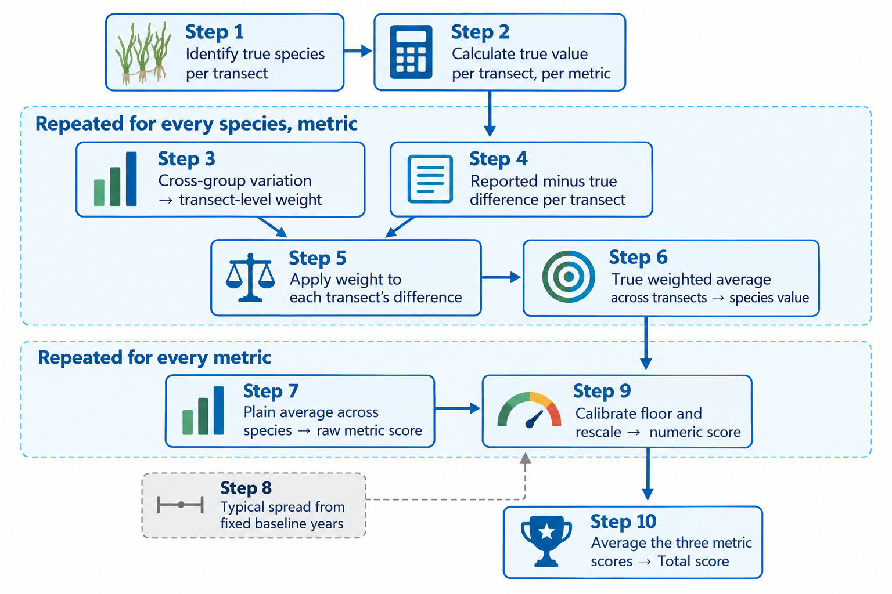

```{r}
library(tbeptools)
library(dplyr)
library(tidyr)
library(purrr)
library(ggplot2)
library(gt)
library(here)

source(here('R/funcs.R'))
load(here('data/trndat.rda'))

# example year used throughout
ex_yr  <- 2025

# difference basis per metric: abundance and blade length on their raw scale,
# short shoot density as percent (see "Why the difference basis differs by
# metric" below for why blade length and short shoot density differ)
scr_metric <- c(Abundance = 'abs', `Blade Length` = 'abs', `Short Shoot Density` = 'pct')

# pre-compute objects reused across sections
truespp  <- truespp_fun(trndat, ex_yr)
truvar   <- truvar_fun(trndat, ex_yr)
cal      <- calibrate_scr_fun(trndat, metric = scr_metric)
allgrpscr <- allgrpscr_fun(trndat, ex_yr, truvar, cal = cal, metric = scr_metric)

# non sav species
non <- '^AA|^DA|^DB|^DG|^DR|^CYAN'

# example group
ex_grp <- trndat |> 
  dplyr::filter(yr == ex_yr) |>
  dplyr::filter(grp == 'C') |> 
  dplyr::pull(grpact) |> 
  unique()

ex_grp_label <- trndat |> 
  dplyr::filter(grpact == ex_grp) |>
  dplyr::pull(grp) |>
  unique()

evalgrp <- evalgrp_fun(trndat, ex_yr, ex_grp, truvar)
```

## Overview

Seagrass transects are monitored in Tampa Bay each year by multiple resource management agencies.  To support these efforts, the Tampa Bay Estuary Program coordinates an annual intercalibration training prior to the field season.  This intercalibration effort ensures that all participating groups are using consistent methods and interpretations. Seagrasses are independently assessed by each group at the same locations and the results are compared using report cards.  The intent of these report cards is to highlight areas where each group is doing well and where efforts could be improved to ensure consistency. This document describes how the report cards are prepared and what the scores mean.

Because there is no single external ground truth, scores are based on how consistently groups agree with each other. A group that reports values close to the cross-group average for the year earns a high score and one that deviates substantially earns a lower score.

Scores are calculated for three field measurements for each seagrass species:

- **Abundance**: Braun-Blanquet (BB) cover category (0 = No cover, 0.1 = Solitary, 0.5 = Few, 1 = <5%, 2 = 5-25%, 3 = 25-50%, 4 = 51-75%, 5 = 76-100%)
- **Blade Length**: average blade length in cm
- **Short Shoot Density**: shoots per m²

Whether each group correctly identified which species were present is also factored into the abundance score. These three metric scores are averaged into an overall total score, which is then converted to a letter grade.

Note that "transect" is used herein to describe the intercalibration sites during training, which are quadrats at fixed locations.  For the actual transect sampling, sites are at set meter marks along a transect line.

### The scoring workflow, step by step

The full scoring workflow, from raw field data to a final letter grade, is:

1. Identify the "true" (consensus) species at each transect.
2. Calculate the "true" value for each metric and species at each transect, as the cross-group average.
3. Calculate the cross-group variation in reported values for each species/transect/metric, for the transect-level weight.
4. Calculate each group's difference (reported minus true) for each species/transect/metric.
5. Apply the transect-level weight from step 3 to each transect's difference from step 4, discounting differences at transects where groups disagreed a lot.
6. Combine the weighted per-transect differences from step 5 across transects into one difference value per species/metric, using a true weighted average (weighted by the same transect-level weight from step 3, not a plain average), so a transect with a larger weight counts for more.
7. Roll up species into a raw metric score as the plain average of those per-species differences.
8. Establish the typical spread of raw metric scores between groups within each year, using a fixed baseline period of `r length(cal$cal_yrs)` years (`r min(cal$cal_yrs)`-`r max(cal$cal_yrs)`). This is the baseline that every year (including years in the baseline itself) is compared against to judge whether a focal year was unusually tight or loose.
9. Calibrate the score floor for that year and metric based on how tight or loose the cohort was that year relative to the typical spread from step 8, then rescale the raw score to a 0–100 numeric score.
10. Get the overall Total score as the plain average of the three metrics' numeric scores, then convert every numeric score, per-metric and Total, to a letter grade using fixed thresholds.

The steps are connected as shown below in the diagram.

{#fig-scoring-process}

The sections below work through each of these ten steps in detail. A full worked example applied to one group follows the detailed descriptions.

## Step 1: The Consensus Species List

Not every species recorded across all groups counts toward scoring. A species at a given transect (site/quadrat) is considered present if at least two distinct groups reported it with non-zero abundance. This removes likely misidentifications while still being inclusive, i.e., a species does not need to be unanimous, just corroborated.  False positives (found by the current group but not found by any other groups) or false negatives (found by at least two other groups but not the current group) are considered in the abundance metric calculations. Species identifications include seagrass and macroalgae. Both are scored on abundance, but only seagrass is used to assess blade length and short shoot density.

```{r}
#| label: tbl-truespp
#| tbl-cap: !expr paste("Consensus species at each transect in", ex_yr, "as species reported by at least two groups.")

truespp |>
  dplyr::count(Site, name = 'n_species') |>
  dplyr::mutate(
    Species = purrr::map_chr(Site, function(s){
      truespp |>
        dplyr::filter(Site == s) |>
        dplyr::pull(Species) |>
        sort() |>
        paste(collapse = ', ')
    }), 
    Site = as.numeric(Site)
  ) |>
  dplyr::rename(Transect = Site, `Species count (richness)` = n_species) |>
  dplyr::arrange(Transect) |> 
  gt::gt() |>
  gt::tab_style(
    style = gt::cell_text(style = 'italic'),
    locations = gt::cells_body(columns = Species)
  ) |>
  gt::cols_align('left') |>
  gt::tab_style(
    style = list(gt::cell_fill(color = '#2166ac'), gt::cell_text(color = 'white', weight = 'bold')),
    locations = gt::cells_column_labels()
  ) |>
  gt::tab_options(
    table.border.top.color = '#2166ac',
    table.border.bottom.color = '#2166ac',
    column_labels.border.bottom.color = '#2166ac'
  )
```

The consensus list is evaluated per transect, so a species may be on the list at one transect but not another.

## Step 2: True Values

For each consensus species at each transect, true values are calculated as the cross-group average:

- **Abundance**: group Braun-Blanquet values (0, 0.1, 0.5, 1, 2, 3, 4, 5) are averaged directly across groups, then snapped to the nearest valid BB value (no coverage, solitary, few, <5%, 5-25%, 26-50%, 51-75%, 76-100%).
- **Blade Length** and **Short Shoot Density**: simple means across groups.

Only consensus species enter this calculation. This prevents a misidentified species (recorded by only one group) from distorting the true values for everyone else.

```{r}
#| label: tbl-truvar
#| tbl-cap: !expr paste('Example "true" values at one transect in', ex_yr, 'determined by cross-group averages for consensus species.')

truvar |>
  dplyr::filter(Site == '8') |> #min(as.numeric(Site))) |>
  tidyr::pivot_wider(names_from = var, values_from = truval) |>
  dplyr::mutate(
    `Abundance (0, 0.5, 1, 2, 3, 4, 5)` = as.character(Abundance),
    `Blade Length (cm)` = ifelse(grepl(non, Species), 'NA', round(`Blade Length`, 1)),
    `Short Shoot Density (per m²)` = ifelse(grepl(non, Species), 'NA', round(`Short Shoot Density`, 1))
  ) |>
  dplyr::select(Transect = Site, Species, `Abundance (0, 0.5, 1, 2, 3, 4, 5)`, `Blade Length (cm)`, `Short Shoot Density (per m²)`) |>
  gt::gt() |>
  gt::tab_style(
    style = gt::cell_text(style = 'italic'),
    locations = gt::cells_body(columns = Species)
  ) |>
  gt::cols_align('left') |>
  gt::tab_style(
    style = list(gt::cell_fill(color = '#2166ac'), gt::cell_text(color = 'white', weight = 'bold')),
    locations = gt::cells_column_labels()
  ) |>
  gt::tab_options(
    table.border.top.color = '#2166ac',
    table.border.bottom.color = '#2166ac',
    column_labels.border.bottom.color = '#2166ac'
  )
```

## Steps 3-7: Group Differences and Metric Scores

For each metric (abundance, blade length, short shoot density), a group's reported values are compared to the true values, species by species and transect by transect, then rolled into a single score per group per metric. Species misidentifications (false positive or false negative) are evaluated first before rollup, since they change what counts as a difference from the true values.

### Species Identification Penalties

Comparing a group's reported values to the true values across all consensus species and transects reveals two types of species identification errors:

**False negatives (missed species)**: a species is present but the group did not record it. The group's abundance for that species is treated as "no coverage" (BB value 0) when computing the difference. The penalty scales with the true abundance of the missed species, such that missing a rare species is a small error, while missing a dominant one is a large error.

**False positives**: the group recorded a species that is not on the consensus list (i.e., no other group confirmed it). The true abundance is treated as "no coverage" (BB value 0), but unlike a missed species, the penalty is a fixed one category difference from zero. What category a group happens to report for a species nobody else saw is not evidence about whether the species was really there, so the penalty does not scale with the reported abundance.

These penalties only affect the abundance score. Blade length and short shoot density cannot be meaningfully penalized for species that were not found.

For abundance, the difference is computed as a gap in ordinal category positions rather than in raw Braun-Blanquet numeric values. The eight BB categories are treated as equally spaced steps (1 = no coverage through 8 = 76–100%), so a difference of 1 means the group was one category apart from the true value, regardless of the numeric gap between those categories on the BB scale.  This implicitly assumes that there is similar difficulty in distinguishing between lower abundances (e.g., solitary vs few) and higher abundances (e.g., 51-75% vs 76-100%).

```{r}
#| label: tbl-evalgrp
#| tbl-cap: !expr paste0('Reported vs. true values for group "', ex_grp_label, '" at one transect in ', ex_yr, '.  Note the missed species in row 1 and the false positive in row 2.')

evalgrp |>
  dplyr::filter(Site == '8') |>
  dplyr::select(
    Transect = Site, Species,
    `Abundance reported` = `Abundance aveval`,
    `Abundance true`     = `Abundance truval`,
    `Blade Length reported` = `Blade Length aveval`,
    `Blade Length true`     = `Blade Length truval`, 
    `Short Shoot Density reported` = `Short Shoot Density aveval`,
    `Short Shoot Density true`     = `Short Shoot Density truval`
  ) |>
  dplyr::mutate(dplyr::across(`Abundance reported`:`Abundance true`, ~ ifelse(is.na(.), '—', as.character(.)))) |>
  dplyr::mutate(dplyr::across(`Blade Length reported`:`Short Shoot Density true`, ~ ifelse(grepl(non, Species), 'NA', as.character(.)))) |>
  dplyr::arrange(Species) |>
  gt::gt() |>
  gt::tab_style(
    style = gt::cell_text(style = 'italic'),
    locations = gt::cells_body(columns = Species)
  ) |>
  gt::cols_align('left') |>
  gt::tab_style(
    style = list(gt::cell_fill(color = '#2166ac'), gt::cell_text(color = 'white', weight = 'bold')),
    locations = gt::cells_column_labels()
  ) |>
  gt::tab_options(
    table.border.top.color = '#2166ac',
    table.border.bottom.color = '#2166ac',
    column_labels.border.bottom.color = '#2166ac'
  )
```

### Per-transect difference and weight

Group scores are based entirely on how similar their estimates compare to the across-group average (the "true" estimate).  The within group difference is also weighted based on how variable the estimates were between groups.  At each transect, a difference is discounted when the different groups had highly variable estimates. That disagreement reflects how hard the species/metric was to measure at that specific site.

At transect $t$, the difference for species $s$ is

$$
d_{s,t} = \text{reported} - \text{true}
$$

for abundance (an ordinal category-position difference, see *Species Identification Penalties* above) and blade length (a raw difference in cm), or the symmetric percent difference

$$
d_{s,t} = \frac{\text{reported} - \text{true}}{(\text{reported}+\text{true})/2}
$$

for short shoot density (see *Absolute vs. percent difference* below). The one exception is a false positive transect for abundance (see *Species Identification Penalties* above), where $d_{s,t}$ is fixed at 1 rather than computed from the reported category, since what category was reported is not evidence about whether the species was really there. 

A species weight at a given transect is

$$
w_{s,t} = \frac{1}{1+\sigma_{s,t}}
$$

where $\sigma_{s,t}$ is the standard deviation, across all groups, of their individually reported values at that transect for that species:

$$
\sigma_{s,t} = \text{SD}\!\left(x_{s,t}\right)
$$

with $x_{s,t}$ denoting all reported values across the groups for species $s$ at transect $t$, and the standard deviation taken across all reporting groups, not just the group being scored. It measures how much trouble groups had agreeing with each other right there. A transect where fewer than two groups reported a value has an undefined $\sigma_{s,t}$ and gets full weight ($w_{s,t}=1$). This is independent of how much the true value itself might vary from one transect to another. That spatial variability plays no role anywhere in scoring.

### Rolling up to a species value

The species-level difference is a true weighted average, across transects, of the per-transect differences:

$$
\bar{d}_s = \frac{\sum_{t=1}^{T} w_{s,t}\,d_{s,t}}{\sum_{t=1}^{T} w_{s,t}}
$$

A transect's influence on $\bar{d}_s$ scales with its weight $w_{s,t}$, so a transect discounted for poor cross-group agreement is proportionally down-weighted relative to the other transects, rather than simply contributing a smaller value while every transect still counts equally toward the denominator.

### When weighting matters

The weight $w_{s,t}$ makes a difference count for less when groups had a lot of trouble agreeing with each other at that transect. Whether that raises or lowers $\bar{d}_s$ compared to a plain (unweighted) average of the same transects depends on whether the group's *large* differences happened to fall on the *hard* transects (high cross-group disagreement) or the *easy* ones (low disagreement). The two scenarios below use one hypothetical species reported at two transects to illustrate both cases.

```{r}
#| include: false
make_transect_scenario_tbl <- function(label, sigma, abs_dev){
  weight <- round(1 / (1 + sigma), 2)
  wavg   <- round(sum(weight * abs_dev) / sum(weight), 2)
  uwavg  <- round(mean(abs_dev), 2)
  sp_rows <- tibble::tibble(
    label = label, sigma = sigma, abs_dev = abs_dev, weight = weight
  )
  sm_rows <- tibble::tibble(
    label = c('Weighted average', 'Unweighted average'),
    sigma = NA_real_, abs_dev = NA_real_,
    weight = c(wavg, uwavg)
  )
  dplyr::bind_rows(sp_rows, sm_rows) |>
    gt::gt() |>
    gt::cols_label(
      label  = '',
      sigma  = gt::html('σ<sub>s,t</sub>'),
      abs_dev = gt::html('|d<sub>s,t</sub>|'),
      weight = gt::html('w<sub>s,t</sub> / average')
    ) |>
    gt::sub_missing(missing_text = '') |>
    gt::tab_style(
      style = list(gt::cell_fill(color = '#f0f0f0'), gt::cell_text(weight = 'bold')),
      locations = gt::cells_body(rows = label %in% c('Weighted average', 'Unweighted average'))
    ) |>
    gt::tab_style(
      style = gt::cell_text(weight = 'bold', color = '#2166ac'),
      locations = gt::cells_body(columns = weight, rows = label == 'Weighted average')
    ) |>
    gt::tab_style(
      style = gt::cell_text(weight = 'bold', color = '#d73027'),
      locations = gt::cells_body(columns = weight, rows = label == 'Unweighted average')
    ) |>
    gt::cols_align('center', columns = -label) |>
    gt::tab_style(
      style = list(gt::cell_fill(color = '#2166ac'), gt::cell_text(color = 'white', weight = 'bold')),
      locations = gt::cells_column_labels()
    ) |>
    gt::tab_options(
      table.border.top.color = '#2166ac',
      table.border.bottom.color = '#2166ac',
      column_labels.border.bottom.color = '#2166ac'
    )
}
```

**Scenario 1: a large difference on a hard transect is discounted, lowering the score**

A group is close to the true value at an easy transect (all groups agreed closely there, $\sigma_{s,t}=0$) but far off at a hard transect (groups disagreed a lot, $\sigma_{s,t}=3$).

```{r}
#| label: tbl-scenario1
#| tbl-cap: "Scenario 1: a large difference falls on the hard transect. The weighted average (blue) is lower than the unweighted average (red), reflecting an appropriately reduced penalty for missing a naturally hard-to-pin-down transect."
make_transect_scenario_tbl(
  label   = c('Transect A (easy, σ = 0)', 'Transect B (hard, σ = 3)'),
  sigma   = c(0, 3),
  abs_dev = c(0.5, 4.0)
)
```

Without weighting, the two transects average to 2.25. With weighting, Transect B's large difference is discounted because groups naturally struggled to agree there, yielding a weighted average of 1.2, a substantially better score. The group missed a hard target, and the scoring system appropriately reduces the penalty for that miss.

**Scenario 2: a large difference on an easy transect is not discounted, raising the score**

Now the same group is far off at the easy transect but close at the hard one.

```{r}
#| label: tbl-scenario2
#| tbl-cap: "Scenario 2: a large difference falls on the easy transect. The weighted average (blue) is higher than the unweighted average (red), appropriately penalizing a large miss on a transect where all groups should have agreed."
make_transect_scenario_tbl(
  label   = c('Transect A (easy, σ = 0)', 'Transect B (hard, σ = 3)'),
  sigma   = c(0, 3),
  abs_dev = c(3.0, 0.5)
)
```

Without weighting, the two transects average to 1.75. With weighting, the small difference at the hard transect counts for less, so it no longer offsets the large miss at the easy transect, yielding a weighted average of 2.5. This is the appropriate outcome, since missing badly on a transect where all groups should agree is a genuine measurement error and should not be diluted by being close on a transect that is naturally harder to pin down.

The weight $w_{s,t}$ does not systematically produce better or worse scores than a simple average. Whether it is higher or lower depends on the data. What it always does is give more say to transects where cross-group agreement was good, and less relative say to transects where even the group of observers as a whole struggled to agree, regardless of whether the scored group's own report happened to be close or far off there.

### Combining species into a metric score

The metric score is a plain average, across species, of each species' absolute difference:

$$
\text{metric score}_{\text{raw}} = \frac{1}{S}\sum_s |\bar{d}_s|
$$

where $S$ is the number of species with a defined $\bar{d}_s$ that year. No further weighting is applied here. 


```{r}
#| label: tbl-sppdiff
#| tbl-cap: !expr paste0("Per-species difference summary of the abundance metric across sites for group '", ex_grp_label, "' in ", ex_yr, ".")

sppdiff_fun(evalgrp, 'Abundance') |>
  dplyr::mutate(
    aveval  = factor(aveval  - 1, levels = 0:7,
                     labels = c('no coverage','solitary','few','<5%','5-25%','25-50%','51-75%','76-100%')),
    truval  = factor(truval  - 1, levels = 0:7,
                     labels = c('no coverage','solitary','few','<5%','5-25%','25-50%','51-75%','76-100%')),
    avediff = round(avediff, 2)
  ) |>
  dplyr::select(Species, `Reported (avg)` = aveval, `True (avg)` = truval,
                `Mean difference` = avediff) |>
  gt::gt() |>
  gt::sub_missing(missing_text = '—') |>
  gt::cols_label(
    `Mean difference` = gt::html('Mean difference (d̅<sub>s</sub>)')
  ) |>
  gt::tab_style(
    style = gt::cell_text(style = 'italic'),
    locations = gt::cells_body(columns = Species)
  ) |>
  gt::cols_align('left') |>
  gt::tab_style(
    style = list(gt::cell_fill(color = '#2166ac'), gt::cell_text(color = 'white', weight = 'bold')),
    locations = gt::cells_column_labels()
  ) |>
  gt::tab_options(
    table.border.top.color = '#2166ac',
    table.border.bottom.color = '#2166ac',
    column_labels.border.bottom.color = '#2166ac'
  )
```

```{r}
#| include: false
spd_abu <- sppdiff_fun(evalgrp, 'Abundance') |>
  dplyr::mutate(abs_dev = round(abs(avediff), 2))
N_abu <- round(sum(spd_abu$abs_dev), 2)
S_abu <- nrow(spd_abu)
raw_abu <- round(N_abu / S_abu, 3)
```

To see how these combine into a raw metric score, consider the abundance values for group `r ex_grp_label` in @tbl-sppdiff above. Taking the absolute values of the mean differences, the `r S_abu` species have $|\bar{d}_s|$ of `r paste(spd_abu$abs_dev, collapse = ', ')`. The raw abundance score is their plain average:

$$\frac{1}{S}\sum_s|\bar{d}_s| = \frac{`r paste(spd_abu$abs_dev, collapse = ' + ')`}{`r S_abu`} = `r raw_abu`$$

matching the abundance value shown in the "Raw score" row of @tbl-example-scores in the full worked example below. This raw score is then scaled to a numeric score on a 0–100 scale using the range of scores across groups, which is then converted to a letter grade (see next steps).

### Absolute vs. percent difference

$d_{s,t}$ is not defined the same way for every metric:

- **Abundance** uses the raw difference in ordinal Braun-Blanquet category positions (as described in *Species Identification Penalties* above). These categories are already unitless and applied the same way to every species, so there is no reason to convert them to a percent basis.
- **Blade Length** uses the raw difference in cm.
- **Short Shoot Density** instead uses the symmetric percent difference (CV). This metric is measured in physical units (shoots/m²) where the typical magnitude varies a great deal by species (e.g., Halodule is characteristically much denser than Thalassia). The percent difference puts every species and every year on the same relative scale.  The reasoning for doing so is justified below.

The weight $\sigma_{s,t}$ follows the same basis as $d_{s,t}$ for each metric:

- **Abundance** and **Blade Length** use $\sigma_{s,t}$ directly, in raw units (category positions, cm).
- **Short Shoot Density** instead uses $\sigma_{s,t}$'s **coefficient of variation**, dividing it by the true value at that transect, for the same reason $d_{s,t}$ does.

When $\sigma_{s,t}$ cannot be computed (fewer than two groups reporting at that transect), the weight defaults to its neutral value, full weight ($w_{s,t}=1$), for every metric.

For short shoot density, percent normalization is appropriate when the typical size of a measurement disagreement itself scales with the magnitude of the true value. If disagreement is instead roughly constant regardless of magnitude, dividing by the true value doesn't remove a scale effect, it creates one.  This is why abundance and blade length scores are based on absolute differences.

The figure below demonstrates these differences by showing every species/year combination across the full training record for abundance (left), blade length (middle), and short shoot density (right). The x-axis shows the "true" values for the year/species combination and the y-axis shows the mean absolute disagreement between groups.

```{r}
#| label: fig-magnitude-error
#| fig-cap: "Mean absolute disagreement between groups vs. true value magnitude, one point per species/year, across the full training record. Short shoot density shows a strong positive relationship where disagreement grows with density. Abundance and blade length show no comparable positive relationship."
#| fig-height: 4.5
#| fig-width: 9.5

all_yrs <- sort(unique(trndat$yr))

mag_err_dat <- purrr::map(c('Abundance', 'Blade Length', 'Short Shoot Density'), function(vr){
  purrr::map(all_yrs, function(y){
    tv   <- truvar_fun(trndat, y)
    grps <- trndat |> dplyr::filter(yr == y) |> dplyr::pull(grpact) |> unique()
    purrr::map(grps, function(g){
      eg <- evalgrp_fun(trndat, y, g, tv)
      sppdiff_fun(eg, vr) |> dplyr::mutate(grpact = g, yr = y, metric = vr)
    }) |> dplyr::bind_rows()
  }) |> dplyr::bind_rows()
}) |> dplyr::bind_rows()

mag_err_summ <- mag_err_dat |>
  dplyr::summarize(
    true_val = mean(truval, na.rm = TRUE),
    abs_diff = mean(abs(avediff), na.rm = TRUE),
    .by = c(metric, yr, Species)
  ) |>
  dplyr::filter(!is.na(true_val), !is.na(abs_diff))

mag_err_cor <- mag_err_summ |>
  dplyr::summarize(r = round(cor(true_val, abs_diff), 2), .by = metric)

ggplot(mag_err_summ, aes(x = true_val, y = abs_diff)) +
  geom_point(aes(color = factor(yr)), size = 2.2, alpha = 0.8) +
  geom_smooth(method = 'lm', se = FALSE, color = 'black', linewidth = 0.6) +
  geom_text(
    data = mag_err_cor, aes(label = paste0('r = ', r)),
    x = -Inf, y = Inf, hjust = -0.2, vjust = 1.5, inherit.aes = FALSE,
    size = 3.3, fontface = 'bold'
  ) +
  facet_wrap(~ metric, scales = 'free', nrow = 1) +
  scale_color_viridis_d(name = 'Year') +
  labs(x = 'Species true value that year (category, cm, or shoots/m²)',
       y = 'Mean absolute difference across\ngroups (category, cm, or shoots/m²)') +
  theme_bw(base_size = 11) +
  theme(strip.background = element_rect(fill = '#004F7E'),
        strip.text = element_text(color = 'white', face = 'bold'),
        legend.position = 'bottom')
```

For short shoot density, disagreement increases with higher density (r = `r mag_err_cor$r[mag_err_cor$metric == 'Short Shoot Density']`). Percent difference removes that effect, so a year or species with a naturally denser bed isn't penalized more just for being dense.

The figure below confirms that the effect is removed for short shoot density. The y-axis is now shown as the percent (CV) difference actually used for scoring, instead of the raw shoots/m² difference shown above.

```{r}
#| label: fig-magnitude-error-cv
#| fig-cap: "Mean absolute percent (CV) difference between groups vs. true value magnitude for short shoot density, one point per species/year, across the full training record. Unlike the raw shoots/m² difference in the previous figure, this shows only a weak relationship with density, confirming the percent basis removes most of the scale effect."
#| fig-height: 4
#| fig-width: 6

ssd_cv_summ <- mag_err_dat |>
  dplyr::filter(metric == 'Short Shoot Density') |>
  dplyr::summarize(
    true_val    = mean(truval, na.rm = TRUE),
    abs_pctdiff = mean(abs(aveperc), na.rm = TRUE),
    .by = c(yr, Species)
  ) |>
  dplyr::filter(!is.na(true_val), !is.na(abs_pctdiff))

ssd_cv_cor <- round(cor(ssd_cv_summ$true_val, ssd_cv_summ$abs_pctdiff), 2)

ggplot(ssd_cv_summ, aes(x = true_val, y = abs_pctdiff)) +
  geom_point(aes(color = factor(yr)), size = 2.2, alpha = 0.8) +
  geom_smooth(method = 'lm', se = FALSE, color = 'black', linewidth = 0.6) +
  annotate('text', x = -Inf, y = Inf, label = paste0('r = ', ssd_cv_cor),
           hjust = -0.2, vjust = 1.5, size = 3.3, fontface = 'bold') +
  scale_color_viridis_d(name = 'Year') +
  scale_y_continuous(labels = scales::percent) +
  labs(x = 'Species true value that year (shoots/m²)',
       y = 'Mean absolute percent difference\nacross groups') +
  theme_bw(base_size = 11)
```

## Steps 8-9: Score Calibration

Raw metric scores for each of the three metrics are converted to a 0–100 scale, with a minimum value of 50 that can be increased so that groups can receive better scores when they are more similar to each other.  It prevents any one group from receiving a very low score due to the rescaling even if all groups performed similarly in a given year.

### How calibration works

For each year and metric, the within-year standard deviation of group differences is calculated to assess the spread between groups. Each year/metric spread is then compared to a "typical" spread to determine how similar or different the groups were for that year.  The typical spread is determined from a fixed baseline period calculated using the first `r length(cal$cal_yrs)` years of training data (`r min(cal$cal_yrs)`-`r max(cal$cal_yrs)`). 

The score floor for a given year and metric is:

$$
\text{floor}_{\text{yr, met}} = \max\!\left(50,\ 50 + \left(1 - \frac{\text{SD}_{\text{yr, met}}}{\overline{\text{SD}_{\text{met}}}}\right) \times 50\right)
$$

where $\text{SD}_{\text{yr, met}}$ is the within-year spread for that metric and year, $\overline{\text{SD}_{\text{met}}}$ is the baseline mean standard deviation for the metric described above, and 50 is a scaling constant that sets the maximum possible floor lift (grade-points). The scaling constant is a subjective choice and, in this case, using a value of 50 means that the floor can be raised a total of 50 points for years when groups score similarly.  That is, the maximum lift occurs when all groups agree perfectly setting the ratio to 0, giving a floor of $50 + 50 = 100$, which corresponds to a minimum grade of A. Years when the standard deviation exceeds the baseline value are capped at 50 so that no extra penalty is applied.

The figure below shows every group's raw (before rescale) metric score, one point per group for every training year, to demonstrate the general spread of scores from which the standard deviations are calculated.  

```{r}
#| label: fig-raw-boxplots
#| fig-cap: 'Distribution of raw group scores for each metric and year. Each point is one group and the values in each year/metric are used to estimate the standard deviations in the next figure. The shaded band marks the fixed baseline years used to compute the calibration mean (i.e., mean standard deviation for across the years used for defining "typical spread"). Units are category positions for abundance, cm for blade length, and percent difference for short shoot density, so boxes are only comparable within a panel.'
#| fig-height: 5
#| fig-width: 10

yrs <- sort(unique(trndat$yr))

raw_by_yr <- purrr::map(yrs, function(yr){
  tv <- truvar_fun(trndat, yr)
  allgrpscr_fun(trndat, yr, tv, raw_diff = TRUE, metric = scr_metric) |>
    dplyr::mutate(yr = yr)
}) |>
  dplyr::bind_rows() |>
  tidyr::pivot_longer(-c(grpact, yr), names_to = 'metric', values_to = 'raw_diff') |>
  dplyr::mutate(metric = factor(metric, levels = c('Abundance', 'Blade Length', 'Short Shoot Density')))

cal_band <- tibble::tibble(xmin = 0.5, xmax = length(cal$cal_yrs) + 0.5)

ggplot(raw_by_yr, aes(x = factor(yr), y = raw_diff)) +
  geom_rect(data = cal_band, aes(xmin = xmin, xmax = xmax, ymin = -Inf, ymax = Inf),
            inherit.aes = FALSE, fill = '#958984', alpha = 0.15) +
  geom_boxplot(outlier.shape = NA, fill = '#eef4fb', color = '#2166ac', width = 0.6) +
  geom_jitter(width = 0.12, height = 0, alpha = 0.7, color = '#004F7E', size = 1.8) +
  facet_wrap(~ metric, scales = 'free_y', nrow = 1) +
  labs(x = NULL, y = 'Raw (pre-rescale)\ngroup score') +
  theme_bw(base_size = 10) +
  theme(axis.text.x = element_text(angle = 45, hjust = 1),
        strip.background = element_rect(fill = '#004F7E'),
        strip.text = element_text(color = 'white', face = 'bold'))
```

The next figure shows those distributions as the standard deviation for the year, compared to the mean standard deviation for the baseline period (dashed line).  Years when the ratio of the standard deviation to the baseline mean standard deviation are less than 1 have a raised minimum score (i.e., groups had more similar scores), whereas years when the ratio is at least 1 receive the default floor of 50.

```{r}
#| label: fig-calibration
#| fig-cap: "Within-year spread of group differences for each metric and year. Bar color shows the ratio of each year's spread to the fixed baseline mean (dashed line). Bar labels show the ratio and the resulting score floor. Blue (ratio < 1) years are tighter than the baseline and receive a higher score floor. The shaded band marks the fixed baseline years used to compute that mean. Spread is in category-position units for abundance, cm for blade length, and percent-difference units for short shoot density, so bar heights are only comparable within a panel."
#| fig-height: 5
#| fig-width: 10

yrs <- sort(unique(trndat$yr))

cal_lkp <- tibble::tibble(
  metric  = c('Abundance', 'Blade Length', 'Short Shoot Density'),
  mean_sd = c(cal$mean_sd$Abundance, cal$mean_sd$`Blade Length`,
              cal$mean_sd$`Short Shoot Density`)
)

yr_spreads <- purrr::map(yrs, function(yr){
  tv <- truvar_fun(trndat, yr)
  allgrpscr_fun(trndat, yr, tv, raw_diff = TRUE, metric = scr_metric) |>
    dplyr::summarize(dplyr::across(Abundance:`Short Shoot Density`,
                                   ~ sd(.x, na.rm = TRUE))) |>
    dplyr::mutate(yr = yr)
}) |>
  dplyr::bind_rows() |>
  tidyr::pivot_longer(-yr, names_to = 'metric', values_to = 'sd_avediff') |>
  dplyr::left_join(cal_lkp, by = 'metric') |>
  dplyr::mutate(
    ratio     = sd_avediff / mean_sd,
    floor_adj = as.integer(pmax(50, 50 + (1 - ratio) * 50)),
    metric    = factor(metric, levels = c('Abundance', 'Blade Length', 'Short Shoot Density'))
  )

cal_band <- tibble::tibble(
  xmin = 0.5, xmax = length(cal$cal_yrs) + 0.5
)

ggplot(yr_spreads, aes(x = factor(yr), y = sd_avediff, fill = ratio)) +
  geom_rect(data = cal_band, aes(xmin = xmin, xmax = xmax, ymin = -Inf, ymax = Inf),
            inherit.aes = FALSE, fill = '#958984', alpha = 0.15) +
  geom_col(width = 0.7, color = 'gray40', linewidth = 0.3) +
  geom_hline(aes(yintercept = mean_sd), linetype = 'dashed', linewidth = 0.6) +
  geom_text(aes(label = sprintf('ratio %.2f\nfloor %d', ratio, floor_adj)),
            vjust = -0.25, size = 2.3, lineheight = 0.9) +
  scale_fill_gradient2(low = '#2166ac', mid = '#f7f7f7', high = '#d73027',
                       midpoint = 1, name = 'Ratio') +
  scale_y_continuous(expand = expansion(mult = c(0, 0.28))) +
  facet_wrap(~ metric, scales = 'free_y', nrow = 1) +
  labs(x = NULL, y = 'Within-year SD of\ngroup differences') +
  theme_bw(base_size = 10) +
  theme(legend.position = 'bottom',
        axis.text.x = element_text(angle = 45, hjust = 1),
        strip.background = element_rect(fill = '#004F7E'),
        strip.text = element_text(color = 'white', face = 'bold'))
```

The table below shows the final score floors for each year and metric.  These are the same values in the labels above the barplots in the previous figure.

```{r}
#| label: tbl-floors
#| tbl-cap: "Calibrated score floor by year and metric. Years with consistently tight agreement receive a higher floor, raising the minimum grade for all groups in that year."

yr_spreads |>
  dplyr::select(yr, metric, floor_adj) |>
  tidyr::pivot_wider(names_from = metric, values_from = floor_adj) |>
  dplyr::rename(Year = yr) |>
  gt::gt() |>
  gt::data_color(
    columns = c(Abundance, `Blade Length`, `Short Shoot Density`),
    fn = scales::col_numeric(
      palette = c('#b2d5f7', '#00441b'),
      domain = c(50, 100)
    )
  ) |>
  gt::tab_style(
    style = list(gt::cell_fill(color = '#2166ac'), gt::cell_text(color = 'white', weight = 'bold')),
    locations = gt::cells_column_labels()
  ) |>
  gt::cols_align('center', columns = -Year) |>
  gt::tab_options(
    row.striping.include_table_body = FALSE,
    row.striping.background_color = 'white',
    table.border.top.color = '#2166ac',
    table.border.bottom.color = '#2166ac',
    column_labels.border.bottom.color = '#2166ac'
  )
```

## Step 10: Letter Grades

After calibration, each group's numeric score for each metric falls on a conventional 0–100 scale, with the lowest possible score in a given year defined by the calibrated score floor. The 0–100 label is nominal only to correspond to a recognizable scoring scheme. In practice a score can never fall below that year's floor. These are mapped to letter grades using fixed thresholds:

```{r}
#| label: tbl-grades
#| tbl-cap: "Letter grade thresholds."

tibble::tibble(
  Grade        = c('A', 'A-', 'B+', 'B', 'B-', 'C+', 'C', 'C-', 'D+', 'D'),
  `Score range` = c('95 – 100', '90 – 94', '85 – 89', '80 – 84',
                    '75 – 79', '70 – 74', '65 – 69', '60 – 64', '55 – 59', 'below 55')
) |>
  gt::gt() |>
  gt::cols_align('center') |>
  gt::tab_style(
    style = list(gt::cell_fill(color = '#2166ac'), gt::cell_text(color = 'white', weight = 'bold')),
    locations = gt::cells_column_labels()
  ) |>
  gt::tab_options(
    table.border.top.color = '#2166ac',
    table.border.bottom.color = '#2166ac',
    column_labels.border.bottom.color = '#2166ac'
  )
```

The Total score is the unweighted average of the abundance, blade length, and short shoot density numeric scores, then converted to a letter grade using the same thresholds.

## Worked Example

```{r}
ex_grpscr <- allgrpscr_fun(trndat, ex_yr, truvar, cal = cal, metric = scr_metric) |>
  dplyr::filter(grpact == ex_grp)

ex_grpscr_raw <- allgrpscr_fun(trndat, ex_yr, truvar, cal = cal, raw = TRUE, metric = scr_metric) |>
  dplyr::filter(grpact == ex_grp)
```

The example below applies the general workflow from above to group `r ex_grp_label` in `r ex_yr`, starting from the raw per-transect data.

### Raw differences

The table below shows the raw data used for scoring.  Each row is one transect (site) and species (macroalgae or seagrass), with the group's reported value, the cross-group true value, and the weighted difference between them for each metric (a percent difference for short shoot density, a cm difference for blade length, a category-position difference for abundance). The weighted difference column is already discounted by the transect-level weight $w_{s,t}$ and not simply the difference between reported and true (unless the weight is 1). Likewise, the "Average" row below each species is a true weighted average of the transect-level values above it (the sum of the weighted differences divided by the weights).  An example for one species using the weights follows this table.

```{r}
#| label: tbl-example-evalgrp
#| tbl-cap: !expr paste0("Raw data and initial calculations for group ", ex_grp_label, " in ", ex_yr, ".  Macroalgae are shown first (no blade lengths or short shoot density) followed by seagrass.  The differences between reported and true are weighted. Similarly, the Average row per species is a true weighted average of the difference values (not a plain average).")

vars_ord <- c('Abundance', 'Blade Length', 'Short Shoot Density')

base_dat <- evalgrp |>
  dplyr::mutate(Transect = as.numeric(Site))

mkcols <- function(vr){
  rep_v <- as.numeric(base_dat[[paste(vr, 'aveval')]])
  tru_v <- as.numeric(base_dat[[paste(vr, 'truval')]])
  sdg_v <- as.numeric(base_dat[[paste(vr, 'sdgrp')]])
  if(scr_metric[[vr]] == 'pct'){
    diff_v <- ifelse(is.na(rep_v) | is.na(tru_v) | tru_v == 0, NA, (rep_v - tru_v) / ((rep_v + tru_v) / 2))
    sprd_v <- ifelse(is.na(sdg_v) | is.na(tru_v) | tru_v == 0, NA, sdg_v / tru_v)
  } else {
    diff_v <- ifelse(is.na(rep_v) | is.na(tru_v), NA, rep_v - tru_v)
    sprd_v <- sdg_v
  }
  wt_v     <- 1 / (1 + ifelse(is.na(sprd_v), 0, sprd_v))
  wdiff_v  <- diff_v * wt_v
  diff_fmt <- if(scr_metric[[vr]] == 'pct'){
    ifelse(is.na(wdiff_v), '—', paste0(sprintf('%.0f', wdiff_v * 100), '%'))
  } else {
    ifelse(is.na(wdiff_v), '—', as.character(round(wdiff_v, 2)))
  }
  tibble::tibble(
    rep = ifelse(is.na(rep_v), '—', as.character(rep_v)),
    tru = ifelse(is.na(tru_v), '—', as.character(tru_v)),
    dif = diff_fmt
  )
}

metcols <- purrr::map(vars_ord, mkcols) |> purrr::set_names(vars_ord)

pertrn <- tibble::tibble(Species = base_dat$Species, Transect = as.character(base_dat$Transect), sort_key = base_dat$Transect)
for(vr in vars_ord){
  pertrn[[paste(vr, 'reported')]] <- metcols[[vr]]$rep
  pertrn[[paste(vr, 'true')]]     <- metcols[[vr]]$tru
  pertrn[[paste(vr, 'diff')]]     <- metcols[[vr]]$dif
}

# species-level average row per metric, using the same sppdiff_fun values
# (and the same paired-transect calculation) used to compute the actual score
avgrows <- purrr::map(sort(unique(base_dat$Species)), function(sp){
  row <- list(Species = sp, Transect = 'Average', sort_key = Inf)
  for(vr in vars_ord){
    sd <- sppdiff_fun(evalgrp, vr) |> dplyr::filter(Species == sp)
    devval <- if(nrow(sd) == 0) NA else if(scr_metric[[vr]] == 'pct') sd$aveperc[1] else sd$avediff[1]
    row[[paste(vr, 'reported')]] <- '—'
    row[[paste(vr, 'true')]]     <- '—'
    row[[paste(vr, 'diff')]] <- if(is.na(devval)){
      '—'
    } else if(scr_metric[[vr]] == 'pct'){
      paste0(sprintf('%.0f', devval * 100), '%')
    } else {
      as.character(devval)
    }
  }
  tibble::as_tibble(row)
}) |>
  dplyr::bind_rows()

dplyr::bind_rows(pertrn, avgrows) |>
  dplyr::arrange(Species, sort_key) |>
  dplyr::select(-sort_key) |>
  gt::gt(groupname_col = 'Species') |>
  gt::tab_spanner(label = 'Abundance', columns = dplyr::starts_with('Abundance')) |>
  gt::tab_spanner(label = 'Blade Length', columns = dplyr::starts_with('Blade Length')) |>
  gt::tab_spanner(label = 'Short Shoot Density', columns = dplyr::starts_with('Short Shoot Density')) |>
  gt::cols_label(
    `Abundance reported` = 'Reported', `Abundance true` = 'True', `Abundance diff` = 'Weighted Diff',
    `Blade Length reported` = 'Reported', `Blade Length true` = 'True', `Blade Length diff` = 'Weighted Diff',
    `Short Shoot Density reported` = 'Reported', `Short Shoot Density true` = 'True', `Short Shoot Density diff` = 'Weighted Diff'
  ) |>
  gt::tab_style(
    style = list(gt::cell_fill(color = '#004F7E'), gt::cell_text(color = 'white', weight = 'bold')),
    locations = gt::cells_row_groups()
  ) |>
  gt::tab_style(
    style = list(gt::cell_fill(color = '#f0f0f0'), gt::cell_text(weight = 'bold')),
    locations = gt::cells_body(rows = Transect == 'Average')
  ) |>
  gt::text_transform(
    locations = gt::cells_body(columns = Transect, rows = Transect == 'Average'),
    fn = function(x) vapply(x, function(v) paste0(v, ' (d̅<sub>s</sub>)'), character(1), USE.NAMES = FALSE)
  ) |>
  gt::cols_align('left') |>
  gt::tab_style(
    style = list(gt::cell_fill(color = '#2166ac'), gt::cell_text(color = 'white', weight = 'bold')),
    locations = gt::cells_column_labels()
  ) |>
  gt::tab_style(
    style = list(gt::cell_fill(color = '#2166ac'), gt::cell_text(color = 'white', weight = 'bold')),
    locations = gt::cells_column_spanners()
  ) |>
  gt::tab_options(
    table.border.top.color = '#2166ac',
    table.border.bottom.color = '#2166ac',
    column_labels.border.bottom.color = '#2166ac'
  )
```

```{r}
#| include: false

# pick the metric/species combination for this group where the two ways of
# computing a difference diverge the most, so the illustration below is
# concrete rather than a coincidental wash. Restricted to metrics actually
# scored on percent difference, this divergence (average-of-ratios vs.
# ratio-of-averages) is a property of the percent transform and doesn't
# arise for a metric scored on a plain (linear) difference like blade length
pct_metrics <- names(scr_metric)[scr_metric == 'pct' & names(scr_metric) != 'Abundance']
illus_dat <- purrr::map(pct_metrics, function(vr){
  evalgrp |>
    dplyr::filter(Species %in% savspecies()) |>
    dplyr::transmute(
      metric = vr,
      Site,
      Species,
      aveval = as.numeric(.data[[paste(vr, 'aveval')]]),
      truval = as.numeric(.data[[paste(vr, 'truval')]]),
      sdgrp  = as.numeric(.data[[paste(vr, 'sdgrp')]])
    )
}) |>
  dplyr::bind_rows() |>
  dplyr::filter(!is.na(aveval), !is.na(truval)) |>
  dplyr::mutate(
    perdiff = aveval - truval,
    perpct  = (aveval - truval) / ((aveval + truval) / 2),
    cvgrp   = ifelse(is.na(sdgrp) | truval == 0, NA, sdgrp / truval),
    wt      = 1 / (1 + ifelse(is.na(cvgrp), 0, cvgrp)),
    wpct    = perpct * wt
  )

illus_summ <- illus_dat |>
  dplyr::summarize(
    n = dplyr::n(),
    pct_of_avg   = ifelse(mean(truval) == 0, NA, (mean(aveval) - mean(truval)) / ((mean(aveval) + mean(truval)) / 2)),
    avg_of_pct   = mean(perpct, na.rm = TRUE),
    # true weighted average (sum(w*x)/sum(w)), matching how sppdiff_fun
    # computes aveperc/avediff, not a plain mean of the already-weighted
    # per-transect values
    num_wt       = sum(perpct * wt, na.rm = TRUE),
    sum_wt       = sum(wt[!is.na(perpct)], na.rm = TRUE),
    wavg_of_pct  = num_wt / sum_wt,
    .by = c(metric, Species)
  ) |>
  dplyr::filter(n >= 2) |>
  dplyr::mutate(gap = abs(avg_of_pct - pct_of_avg)) |>
  dplyr::arrange(dplyr::desc(gap))

illus_metric <- illus_summ$metric[1]
illus_spp    <- illus_summ$Species[1]

illus_rows <- illus_dat |>
  dplyr::filter(metric == illus_metric, Species == illus_spp) |>
  dplyr::arrange(Site)
```

To demonstrate how the weights are factored into the weighted differences and the species averages, the table below shows the full example for group `r ex_grp_label`'s `r tolower(illus_metric)` for *`r illus_spp`*:

```{r}
#| label: tbl-example-pairing
#| tbl-cap: !expr paste0("Per-transect reported vs. true ", tolower(illus_metric), " for *", illus_spp, "*, group ", ex_grp_label, ", ", ex_yr, ". The percent difference is computed separately at each transect, then discounted by that transect's cross-group weight, before averaging.")

illus_rows |>
  dplyr::transmute(
    Transect = as.numeric(Site),
    Reported = round(aveval, 1),
    True     = round(truval, 1),
    `Percent difference` = paste0(sprintf('%.0f', perpct * 100), '%'),
    cvst   = ifelse(is.na(cvgrp), '—', sprintf('%.2f', cvgrp)),
    wtst   = sprintf('%.2f', wt),
    `Weighted % difference` = paste0(sprintf('%.0f', wpct * 100), '%')
  ) |>
  gt::gt() |>
  gt::cols_label(
    cvst = gt::html('Cross-group CV (σ<sub>s,t</sub>)'),
    wtst = gt::html('Weight (w<sub>s,t</sub>)')
  ) |>
  gt::cols_align('left') |>
  gt::tab_style(
    style = list(gt::cell_fill(color = '#2166ac'), gt::cell_text(color = 'white', weight = 'bold')),
    locations = gt::cells_column_labels()
  ) |>
  gt::tab_options(
    table.border.top.color = '#2166ac',
    table.border.bottom.color = '#2166ac',
    column_labels.border.bottom.color = '#2166ac'
  )
```

Averaging the raw "Percent difference" column above gives `r sprintf('%.0f', illus_summ$avg_of_pct[1] * 100)`%, which is not what is used for the species average metric difference ($\bar{d}_s$). The average difference is based on the weighted differences and the weights, estimated as a true weighted average.  This is done by summing the weighted differences (`r round(illus_summ$num_wt[1], 2)`) and then dividing by the weights (`r round(illus_summ$sum_wt[1], 2)`), yielding `r sprintf('%.0f', illus_summ$wavg_of_pct[1] * 100)`%, matching the Average row for *`r illus_spp`*'s `r tolower(illus_metric)` in @tbl-example-evalgrp above.

### Scores

For each metric, the mean absolute difference per species ($|\bar{d}_s|$) is listed in a single comma-separated cell. The "Raw score" row below it shows the plain average of those values, the calibrated score floor, the rescaled numeric score, and the letter grade.  The raw score is a plain average since the differences per species are already weighted.

```{r}
#| label: tbl-example-scores
#| tbl-cap: !expr paste0("Score derivation for group ", ex_grp_label, " in ", ex_yr, ". The 'Species |d̅s|' row lists each species' mean absolute difference from Steps 3-7 in one comma-separated cell. The 'Raw score' row shows the average of those values and its conversion to a calibrated numeric score and letter grade via the score floor. |d̅s| is a percent difference (fraction) for short shoot density, a cm difference for blade length, and a category-position difference for abundance.")

metrics_ord <- c('Abundance', 'Blade Length', 'Short Shoot Density')

# Pre-rescaling average absolute difference per metric for this group
ex_rawd <- allgrpscr_fun(trndat, ex_yr, truvar, raw_diff = TRUE, metric = scr_metric) |>
  dplyr::filter(grpact == ex_grp)

# Score floors for this year
ex_floors <- yr_spreads |>
  dplyr::filter(yr == ex_yr) |>
  dplyr::select(metric, floor_adj) |>
  dplyr::mutate(metric = as.character(metric))

# Per-species contributions combined into a single comma-separated cell per
# metric (rather than one row per species): every other column is blank on a
# per-species row, so spelling them out one row at a time was mostly
# whitespace next to the handful of summary values that actually differ
spp_combined <- purrr::map(metrics_ord, function(vr){
  lbl <- sppdiff_fun(evalgrp, vr) |>
    dplyr::mutate(
      devval  = if(scr_metric[[vr]] == 'pct') aveperc else avediff,
      abs_dev = round(abs(devval), 2)
    ) |>
    dplyr::mutate(lbl = paste0('*', Species, '*', ' (', abs_dev, ')')) |>
    dplyr::pull(lbl) |>
    paste(collapse = ', ')

  tibble::tibble(
    metric        = vr,
    row_type      = 'species',
    Species       = lbl,
    raw_score     = NA_real_, floor_adj = NA_integer_,
    numeric_score = NA_real_, grade = NA_character_
  )
}) |>
  dplyr::bind_rows()

# Summary rows: average raw score -> floor -> numeric score -> grade
sum_rows <- purrr::map(metrics_ord, function(vr){
  tibble::tibble(
    metric        = vr,
    row_type      = 'summary',
    Species       = 'Raw score (average)',
    raw_score     = round(ex_rawd[[vr]], 3),
    floor_adj     = as.integer(ex_floors$floor_adj[ex_floors$metric == vr]),
    numeric_score = round(as.numeric(ex_grpscr_raw[[vr]]), 1),
    grade         = ex_grpscr[[vr]]
  )
}) |>
  dplyr::bind_rows()

# Total row
total_row <- tibble::tibble(
  metric        = 'Total',
  row_type      = 'total',
  Species       = 'Average of three metric scores',
  raw_score     = NA_real_,
  floor_adj     = NA_integer_,
  numeric_score = round(as.numeric(ex_grpscr_raw$Total), 1),
  grade         = ex_grpscr$Total
)

score_tbl <- dplyr::bind_rows(spp_combined, sum_rows, total_row) |>
  dplyr::mutate(
    metric   = factor(metric, levels = c(metrics_ord, 'Total')),
    sort_key = dplyr::case_when(
      row_type == 'species' ~ 1L,
      row_type == 'summary' ~ 2L,
      TRUE                  ~ 3L
    )
  ) |>
  dplyr::arrange(metric, sort_key) |>
  dplyr::select(-sort_key, -row_type)

score_tbl |>
  gt::gt(groupname_col = 'metric') |>
  gt::cols_label(
    Species       = gt::html('Species |d̅<sub>s</sub>|'),
    raw_score     = gt::html('Raw score<br><em>(average)</em>'),
    floor_adj     = 'Score floor',
    numeric_score = 'Numeric score',
    grade         = 'Letter grade'
  ) |>
  gt::sub_missing(missing_text = '—') |>
  gt::fmt_markdown(columns = Species) |>
  gt::fmt_number(columns = raw_score, decimals = 3) |>
  gt::fmt_number(columns = numeric_score, decimals = 1) |>
  gt::tab_style(
    style = list(gt::cell_fill(color = '#f0f0f0'), gt::cell_text(weight = 'bold')),
    locations = gt::cells_body(rows = Species == 'Raw score (average)')
  ) |>
  gt::tab_style(
    style = gt::cell_text(weight = 'bold'),
    locations = gt::cells_body(rows = Species == 'Average of three metric scores')
  ) |>
  gt::tab_style(
    style = list(gt::cell_fill(color = '#004F7E'), gt::cell_text(color = 'white', weight = 'bold')),
    locations = gt::cells_row_groups()
  ) |>
  gt::tab_style(
    style = list(gt::cell_fill(color = '#2166ac'), gt::cell_text(color = 'white', weight = 'bold')),
    locations = gt::cells_column_labels()
  ) |>
  gt::cols_align('center', columns = c(raw_score, floor_adj, numeric_score, grade)) |>
  gt::tab_source_note(
    source_note = gt::html('The Raw score row is the plain average of |d̅<sub>s</sub>| across species. |d̅<sub>s</sub>| is a percent difference for short shoot density, a cm difference for blade length, and a category-position difference for abundance, already discounted at the transect level for cross-group disagreement (Steps 3-7).')
  ) |>
  gt::tab_options(
    table.border.top.color = '#2166ac',
    table.border.bottom.color = '#2166ac',
    column_labels.border.bottom.color = '#2166ac'
  )
```

The figure below shows how raw scores map to numeric scores across all groups for each metric. The gray line is the linear rescaling anchored at 100 for the best group and at the score floor for the worst. Group `r ex_grp_label` is highlighted in blue.

```{r}
#| label: fig-rescale
#| fig-cap: !expr paste0("Raw score to numeric score rescaling for all groups in ", ex_yr, " by metric. Each dot is one group and group ", ex_grp_label, " (blue) is highlighted with drop lines to both axes. The gray line is the linear mapping from the best group (lowest raw difference, numeric score 100) to the worst (highest raw difference, score floor). The red dashed line shows the calibrated score floor.")
#| fig-height: 4
#| fig-width: 9.5

all_rawd_long <- allgrpscr_fun(trndat, ex_yr, truvar, raw_diff = TRUE, metric = scr_metric) |>
  tidyr::pivot_longer(-grpact, names_to = 'metric', values_to = 'raw_score')

all_num_long <- allgrpscr_fun(trndat, ex_yr, truvar, cal = cal, raw = TRUE, metric = scr_metric) |>
  dplyr::select(-Total) |>
  tidyr::pivot_longer(-grpact, names_to = 'metric', values_to = 'numeric_score')

ex_floors_long <- yr_spreads |>
  dplyr::filter(yr == ex_yr) |>
  dplyr::select(metric, floor_adj) |>
  dplyr::mutate(metric = as.character(metric))

plot_dat <- dplyr::left_join(all_rawd_long, all_num_long, by = c('grpact', 'metric')) |>
  dplyr::left_join(ex_floors_long, by = 'metric') |>
  dplyr::mutate(
    is_example = grpact == ex_grp,
    metric = factor(metric, levels = c('Abundance', 'Blade Length', 'Short Shoot Density'))
  )

line_dat <- plot_dat |>
  dplyr::group_by(metric) |>
  dplyr::summarize(
    x_lo = min(raw_score),
    x_hi = max(raw_score),
    floor_adj = dplyr::first(floor_adj),
    .groups = 'drop'
  )

ex_dat <- plot_dat |> dplyr::filter(is_example)

ggplot(plot_dat, aes(x = raw_score, y = numeric_score)) +
  geom_hline(
    data = line_dat,
    aes(yintercept = floor_adj),
    color = '#d73027', linetype = 'dashed', linewidth = 0.5
  ) +
  geom_segment(
    data = line_dat,
    aes(x = x_lo, xend = x_hi, y = 100, yend = floor_adj),
    color = 'gray50', linewidth = 0.8
  ) +
  geom_segment(
    data = ex_dat,
    aes(x = raw_score, xend = raw_score, y = numeric_score, yend = -Inf),
    color = '#2166ac', linetype = 'dotted', linewidth = 0.6
  ) +
  geom_segment(
    data = ex_dat,
    aes(x = -Inf, xend = raw_score, y = numeric_score, yend = numeric_score),
    color = '#2166ac', linetype = 'dotted', linewidth = 0.6
  ) +
  geom_point(data = plot_dat |> dplyr::filter(!is_example), color = 'gray60', size = 3) +
  geom_point(data = ex_dat, color = '#2166ac', size = 4) +
  geom_label(
    data = ex_dat,
    aes(label = paste0('raw = ', round(raw_score, 3), '\nscore = ', round(numeric_score, 1))),
    hjust = -0.1, size = 2.8, color = '#2166ac', fill = 'white',
    label.size = 0.3, label.padding = unit(0.2, 'lines')
  ) +
  geom_text(
    data = line_dat,
    aes(x = x_hi, y = floor_adj, label = paste0('floor = ', floor_adj)),
    hjust = 1, vjust = -0.5, size = 2.5, color = '#d73027'
  ) +
  scale_y_continuous(breaks = seq(50, 100, 10), expand = expansion(mult = c(0.1, 0.05))) +
  scale_x_continuous(expand = expansion(mult = c(0.05, 0.35))) +
  facet_wrap(~ metric, scales = 'free_x', nrow = 1) +
  labs(x = 'Raw score as the average absolute difference across species\n(ordinal position for abundance, cm for blade length, % difference for short shoot density)', y = 'Numeric score') +
  theme_bw(base_size = 10) +
  theme(
    strip.background = element_rect(fill = '#004F7E'),
    strip.text = element_text(color = 'white', face = 'bold')
  )
```

Finally, the table below shows the group's scores with and without score calibration.  Because groups performed more similarly for all metrics (short shoot density in particular) compared to the baseline period, the floor raises all scores.

```{r}
#| label: tbl-example-cal
#| tbl-cap: !expr paste0("Effect of calibration on scores for group ", ex_grp_label, " in ", ex_yr, ". The floor is the lowest possible score any group could receive in this year for each metric.  Ratios less than one raise the floor above 50. The Average row is the mean of the two score columns across the three metrics.")

yr_spreads_wide <- yr_spreads |>
  dplyr::filter(yr == ex_yr) |>
  dplyr::select(metric, ratio, floor_adj)

ex_grpscr_nocal_raw <- allgrpscr_fun(trndat, ex_yr, truvar, raw = TRUE, metric = scr_metric) |>
  dplyr::filter(grpact == ex_grp) |>
  tidyr::pivot_longer(-grpact, names_to = 'metric', values_to = 'score_before') |>
  dplyr::select(-grpact)

ex_grpscr_cal_raw <- ex_grpscr_raw |>
  tidyr::pivot_longer(-grpact, names_to = 'metric', values_to = 'score_after') |>
  dplyr::select(-grpact)

cal_tbl_dat <- dplyr::left_join(ex_grpscr_nocal_raw, ex_grpscr_cal_raw, by = 'metric') |>
  dplyr::left_join(yr_spreads_wide, by = 'metric') |>
  dplyr::filter(metric != 'Total') |>
  dplyr::mutate(
    dplyr::across(c(score_before, score_after), ~ round(as.numeric(.), 1)),
    ratio = round(ratio, 2),
    floor_adj = as.numeric(floor_adj),
    metric = as.character(metric)
  )

avg_row <- tibble::tibble(
  metric       = 'Average',
  score_before = round(mean(cal_tbl_dat$score_before, na.rm = TRUE), 1),
  score_after  = round(mean(cal_tbl_dat$score_after, na.rm = TRUE), 1),
  ratio        = NA_real_,
  floor_adj    = NA_real_
)

dplyr::bind_rows(cal_tbl_dat, avg_row) |>
  dplyr::rename(
    Metric = metric,
    `Score without calibration` = score_before,
    `Score with calibration` = score_after,
    `Ratio (within-year spread / baseline mean)` = ratio,
    `Score floor` = floor_adj
  ) |>
  dplyr::mutate(
    Metric = factor(Metric, levels = c('Abundance', 'Blade Length', 'Short Shoot Density', 'Average'))
  ) |>
  dplyr::arrange(Metric) |>
  gt::gt() |>
  gt::fmt_number(columns = `Score floor`, decimals = 0) |>
  gt::sub_missing(
    columns = c(`Ratio (within-year spread / baseline mean)`, `Score floor`),
    missing_text = '—'
  ) |>
  gt::cols_align('center', columns = -Metric) |>
  gt::tab_style(
    style = list(gt::cell_fill(color = '#f0f0f0'), gt::cell_text(weight = 'bold')),
    locations = gt::cells_body(rows = Metric == 'Average')
  ) |>
  gt::tab_style(
    style = list(gt::cell_fill(color = '#2166ac'), gt::cell_text(color = 'white', weight = 'bold')),
    locations = gt::cells_column_labels()
  ) |>
  gt::tab_options(
    table.border.top.color = '#2166ac',
    table.border.bottom.color = '#2166ac',
    column_labels.border.bottom.color = '#2166ac'
  )
```
